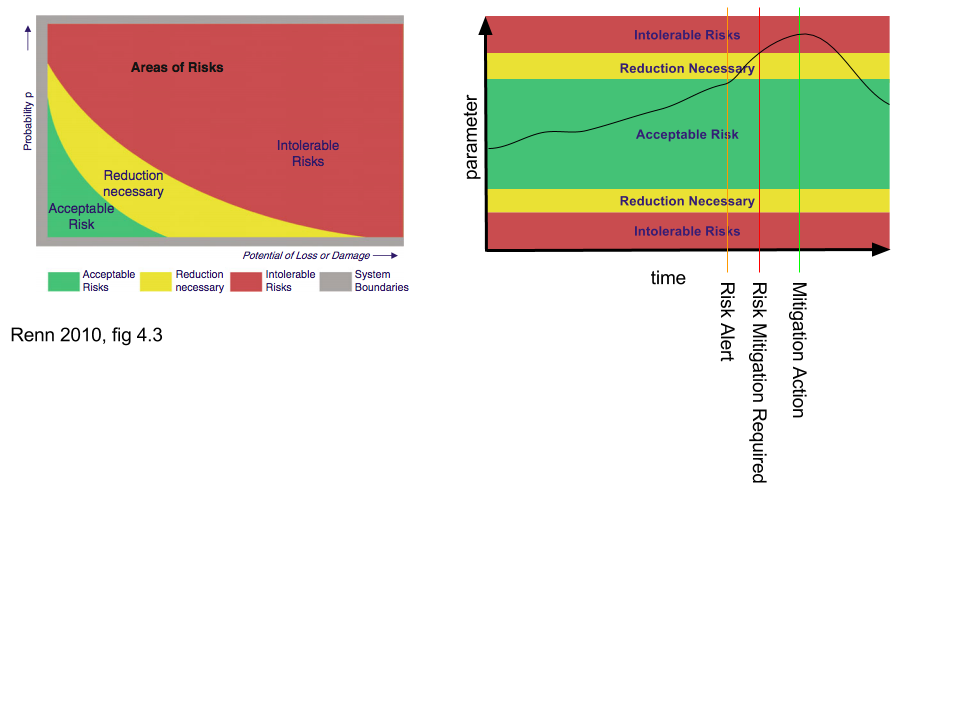

# Abstract

Unconventional energy producers typically operate in challenging regulatory environments that can require region-based measures, where risk mitigation might be different or overlapping, and also emergent legislation, where regulations change over the maturity of a petro-system, or in response to new mitigation requirements. Adding to the regulatory complexity, stakeholder involvement has become major requirement for fair risk governance. This article argues that methods for the development of regulation models should not outpace or be conceived without knowledge of information technology. Rather, that the development of both must take place concurrently, with a dialectical feedback informing limits and capabilities of technology and, importantly, "technology-cost" of risk governance. Further, it is argued that the risk can be translated into the acceptance limits model as a dynamic, timeseries parameter with associated performance indicators, and that software engineering methods of version control and verification may be able to accommodate the successionary regulation concept.

# Notes

* Use the Bom AWRIS project as an example of risk monitoring cost-benefit ($40M for limited functionality)
*  
* Renn traffic light model translated into dynamic risk

* Effective Governance Performance Indicators
  * Time within intolerable risk zone
  * Cost per unit time within intolerable risk zone
  * Data quality value related to cost 

# References 

[@renn_stakeholder_2015]

[@renn_risk_2008]

[@renn_stakeholder_2015]

[@frieburg_tools_2010]

* Regulation a form of goverance
* Successionary model of regulation
** regulation changes of the over maturity of petro system
* Region based regulation
** Each different region has different regulation
* 
* 

