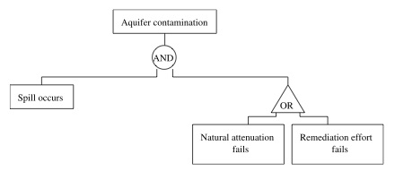

# Title: Generating Data Capture and Visualisation Requirements for Unconventional Energy Risk Governance

# Abstract

A review was conducted of literature with the aim of gathering requirements for a system of risk governance with application to groundwater and Unconventional Energy production. The review covers both current concepts and models regarding the governance of risk within Australia, and also the type of technology and development methods which might be used to accommodate the identified requirements. It was found that there are many different approaches to risk that are relevant to a governance system, and that these increase the complexity of development and place greater emphasis on data-driven approaches.

# Introduction

In the last few years unconventional energy (UE) ^[Unconventional energy in the Australian context, generally refers to gas held in shale or coal formations (CSG), along with what is known as "tight gas" [@taylor_australias_2012, p.7].], including unconventional natural gas development (UNGD) [@werner_environmental_2015] production, has been considered a significant potential economic resource for Australia. 

However it is a potential that faces significant resource, market, governance and environmental challenges with calls to remove unnecessary costs, whilst maintaining robust environmental risk protection [@brockett_streamline_2014; @appea_cutting_2014; @mcdine_east_2015]. 

At the same time, the understanding of risk itself has evolved to include multi-layered socio-political dimensions, and broadened from a state-centric hierarchical management of threats, towards a global, but distributed, risks governance model inclusive of industry, science and non-governmental organizations [@renn_global_2008; @renn_coping_2011; @figuie_towards_2014]. With this broader conception there may be potentially many different views on the risks posed by and to CSG operations [@hunter_regulation_2011].^[In this context this review does not seek to express an opinion on the riskiness of CSG operations, but rather to gather the requirements for a system that can reduce costs of capturing, monitoring, and governing data involving risks, but increase the governance-ability.]

## The Challenges & Problem Scope

Of the challenges facing the UE industry the Committee for Economic Development of Australia (CEDA) report notes that property rights and water management are key issues [@taylor_australias_2012, p.5]. However there are other key challenges which have arisen subsequent to the CEDA report.

### The Financial Challenge 

Recent market conditions of low oil prices and market failures in China have, however, raised doubts over future CSG expansions and greenfields projects [@mchugh_lower_2015].^[The CSG yearly reports, for example, all note the sensitivity of cash flows to global oil prices: "significant fall in oil price, if sustained at current levels, will result in lower growth in cash flow and earnings than previously expected" [@origin_energy_full_2015]; "Sales revenue fell 19% on the corresponding quarter, affected by the lower realised oil price" [@santos_second_2015]; "Revenue and other operating income decreased 19% to $2 557 million, reflecting significantly lower commodity prices, especially oil and liquids"[@bg-group_second_2015].] Financial risk has therefore emerged as another key issue [@lehner_finance_2014; @brandimarte_handbook_2014].

Multiple competing risks therefore need to be managed by multiple entities within a financial context, and as @brockett_streamline_2014 notes, this creates industry calls for regulatory reforms to remove unnecessary costs but still pursue robust independent risk management frameworks aimed at preventing potentially irreversible damage to environmental and hydrological systems [@beckers_groundwater_2013; @howe_framework_2010; @hunter_draft_2013; @davies_managing_2015].  

### The Regulatory Challenge

Partially in response to legislative duplication at the Federal level [@brockett_streamline_2014], the Australian Government initiated the National Harmonized Regulatory Framework (NHRF) [@scer_national_2013], together with a number of subsequent reports plus community feedback. The aim was to address the issues of what all the elements of an UE Risk Governance system are, and how such might fit together [@dnrm_coal_2013; @dnrm_activity_2013; @dnrm_storing_2015; @beckers_groundwater_2013; @qwc_underground_2012; @hunter_global_2015]. 

As @brockett_streamline_2014 noted, different levels of government responded to these calls for action in varying ways. Queensland, for example, developed the Underground Water Management Framework (UWMF) [@qld_state_government_underground_2015] which outlines State-government level components for CSG groundwater regulation. However, whilst this approach of case-by-case regulation may meet State-level regulatory requirements, as @freiberg_tools_2010 has suggested [p. 270], focus on the regulation of a specific issue can leave broader issues unresolved. Indeed the ability of regulatees to employ information systems used to collect data required by regulatory forms is one of these broader issues. 

### The Information System Challenge

In response to increasing regulatory requirements at many levels of governance, database systems have grown incrementally in an ad-hoc manner without consideration for what might be called whole-of-system data requirements [@rajabifard_spatial_2008; @williams_unconventional_2012; @brockett_streamline_2014; @eddie_jennifer_administration_2014].

In Queensland there have been various information systems developed by different entities, each which attempts to accommodate different regulatory requirements.^[These include, but are not limited to, projects such as the Queensland Department of Natural Resources and Mines Ground Water Database (GWDB) [@dnrm_groundwater_2015], the Queensland Department of Natural Resources Water Entitlements system [@dnrm_water_2015], the Office of Groundwater Impact Assessment database [@mines_office_2015], the University of Queensland's Water Atlas [@hunter_web-based_2015], the Santos Water Portal [@santos_santos_2015], The Queensland Globe [@qld_state_government_queensland_2015], the Bore portal [@mines_bore_2015], The Queensland University of Technology Groundwater Visualisation System [@qut_groundwater_2015; @cox_groundwater_2013].]. Hence, as @tomas_towards_2015 has noted more generally, there are significant amounts and varieties of hydrological data available, presenting many system engineering challenges such as accessibility, consistency, comparability, and quality. Nationally, with over 50 years of uncoordinated hydrological digital data collection in Australia^[With some rainfall observation records dating back to the 1850's], more than 200 different information systems and semantics have emerged at a local level [@maguire_something_2015; @denzer_hydroinformatics:_2012]. Specialist system administrators for these systems have also become required and embedded in government and corporate I.T. departments. 

Federally, the National Map [@nicta_national_2015] and Groundwater Explorer [@bom_australian_2015] systems have been developed, along with the AWRIS system [@bom_australian_2015-1]. Globally, the Digital Earth, Open Digital Earth [@degf_digital_2015; @isde_international_2015; @degf_digital_2015], and Infrastructure for Spatial Information in the European Community (INSPIRE) have attempted ambitious projects to integrate the use of many different digital technologies [@keysers_review_2015; @inspire_inspire_2013]. Within these projects, a common approach is to develop 'enabling platforms', using integration and interoperability tools to achieve required datasets [@commonwealth_of_australia_awris_2006; @rajabifard_spatial_2008; @power_maintaining_2011; @lemon_role_2012; @harrison_data_2013; @inspire_inspire_2013; @tomas_towards_2015; @kadadi_challenges_2014; @hauser_interoperability:_2015]. This has been the approach used in the Australian hydrological industry, and some of the Australian experiences will be addressed in more detail below. 

### The Global Risk Governance Challenge

Unlike other continents, Australia has the benefit of being an island with relatively isolated impacts internationally. Hence the incorporation of Global Risk Governance concepts might appear irrelevant for the Australia regulatory context. So amidst the many challenges why consider Global Risk Governance at all? Wouldn't adding a requirement for meeting Global Risk Governance concepts add further Information System and Financial loads? Indeed, @tomas_towards_2015 notes that the (INSPIRE) project required an enormous data harmonisation effort.

The International Risk Governance Council (IRGC) argues that governance mechanisms evolve much more slowly than the processes currently driving technological, environmental and social change [@irgc_what_2015]. The IRGC sees the consequence of this evolution mismatch that policy makers have become conscious of the importance of risk communication and of meeting public expectations. 

When transnational corporate entities seek to operate across multiple National boundaries, a globalised approach to risk governance becomes attractive when it can reduce the requirement for multiple information systems, or costly enhancements of existing systems to meet new requirements from a difference Governance region. Risk governance thus extends beyond conventionally recognised elements of risk analysis to include, 
  
> _matters of institutional design and role, organisational capacity, stakeholder involvement, collaborative decision making and political accountability on the part of public bodies and corporate responsibility on the part of private enterprises. It also includes the requirement on the part of government, commercial and civil society actors for the development and use of scientific knowledge within the risk governance process_. [@renn_global_2008]

Many of these requirements are identified below in response to the CSG context in Australia, which suggests there is a movement towards the Global Risk Governance agenda.

# Aim

The aim of this review is to establish technical requirements of a Risk Governance System (RGS), and evaluate technologies and engineering methods that might be viable solutions to meet these  requirements.

# Method

The approach used here is a requirements-oriented literature review. This approach will generate requirements relevant to different stakeholder perspectives on risk. Each section will be summarized with a table documenting level 1-3 requirements derived from the literature.^[Level 1 requirements are top-level feature requirements. An example might be, "user interface must accept user inputs". Level 3 requirements are at the schema level defining which schema a field or column might occur in. Level 4 & 5 requirements decompose into the attributes and properties of a field (date, string, etc). Levels 4 & 5 are not deemed necessary for the purposes of a literature review. The term 'ability to store and track' is used in the requirements to mean a) that there needs to be a column or field in the database which will be able to store a value, b) that the value may change with time and the database needs to accommodate such.]  The requirements-oriented review will be undertaken concurrently with system development and a review of system engineering approaches that have been used previously to meet those requirements.

Whilst this approach may sacrifice detail in the various reviews, the benefits of a concurrent method is anticipated to be twofold: Firstly, by referring back to the risk literature, there is the opportunity to for a whole-of-system understanding of 'the why', with respects to why the system is being developed, and how such can inform the system engineering process. Secondly, is an understanding of how the limitations of system engineering may inform the ambitions of risk governance. As noted below, disconnects between IT and business representatives responsible for implementation and development can present responsibility, ownership, vision, and, consequently, engineering challenges. It is anticipated that the close affinity between software engineering, review, and requirements generation will enable greater learning from previous attempts to address similar problems, and research how it might can be done differently to improve economic, environmental and/or social benefits. 

# Brief Histories 

## Brief History of Risk

The historical lineage of risk might be viewed as stemming from Ancient times with intertwined and overlapping perspectives crossing, philosophy and theology, sociology and equity politics. Aven and Renn [@aven_risk_2010, pp.50-54] make a distinction between two phases in the history of risk analysis. That of the traditional concepts, associated with risk assessment, management and communication, and that of socio-cultural considerations. 

Citing Grier, Covello and Mumpower claim that the traditional, quantitative, concept of risk assessment first entered intellectual thought in the 4th century AD, through Amobius's theological consideration of the risks posed to one's soul after death [@covello_risk_1985]. Covello and Mumpower argue that prior to 18th century there was almost no history of quantitative probability theory, but at which point there was a flourishing of probability risk analysis (PRA) with a modern prototype developed by LaPlace in application to smallpox vaccination and morbidity probabilities [@covello_risk_1985]. 

In the context environmental policy, the application of PRA is relatively recent [@ferguson_risk_1998, p.7]. In subsurface hydrology, Tartakovsky argues that PRA had not been used until 2007 [@tartakovsky_assessment_2013, p.248]. The aim of introducing PRA to environmental policy was to avoid conflation of political and management goals with environmental objectives, and this was to be done by providing an objective and scientific method [@tartakovsky_assessment_2013].^[a similar conflation has been observed in the humanities @castanos_ortwin_2009]  

However, as discussed below, risk is not only quantitative, but has qualitative dimensions, and in this vein, if the Ancient Greek-to-English translations are accurate, risk associated with combat and epidemic were already mentioned by Thucydides and Hippocrates [@bracken_first_2003], with evidence of epidemics mentioned in an cuneiform tablet dating back to Ancient Babylon 1400 BCE [@hallo_bible_1990, p.431]. Thucydides, for example, said,

> _Concerning the Persian War ... when we were performing those deeds the risk was taken for a common benefit_. [Thucydides in @smith_thucydides:_1962, BOOK I. lxxiii. 1-4]

Indeed the humanitarian discourse concerned with social justice praxis is engaged with understanding the risks that capital and technology pose to the sustainable self-generation of individual, societal and ecological systems [@habermas_philosophical_1987 p. 371; @renn_risk_2008; @castanos_ortwin_2009]. 

This non-technical aspect of the risk discourse, can be seen as an interest that has a continual thread throughout human history. Evolving in accuracy and scope to include the socio-political considerations of distributed authority, co-ordination between stakeholders and functional self-regulation [@renn_global_2008, @renn_risk_2008; @castanos_ortwin_2009; @renn_coping_2011; @irgc_introduction_2012; @figuie_towards_2014].

## Brief History of Systems Engineering

@schlager_systems_1956, locates the origin of the term "systems engineering" with the Bell Telephone Laboratories. It arose from the need to engineer and manage systems of significant complexity, where it was observed that satisfactory components did not necessarily combine to produce a satisfactory system [p.64]. The intent was to provide formal methods of truly engineering system synthesis and optimization using probability and statistics, rather than system development through educated guesswork.

It has been applied and formalised in the engineering of space and military systems [@rook_controlling_1986; @mooz_4.4.3_2001; @lightsey_systems_2001; @kossiakoff_systems_2002; @stamatelatos_fault_2002; @estefan_survey_2007; @nasa_nasa_2007; @clark_system_2009; @stamatelatosmichael_probabilistic_2011], with cornerstone concepts such as the "V-Model" [@mooz_visualizing_1997], and specialist software packages like Vitech's CORE^TM has been constructed to facilitate complex systems engineering process [@vitech_core_2015]. Conversely, the history of code research, or hacking, can often follow a very different path without a systemic method, and approached from the investigative trial and error method.

# General Legislative Requirements

## Water Monitoring Strategy Adaptive Risk Management & (WMS-ARM) 

The Water Monitoring Strategy (WMS) used in the Surat Underground Water Impact Report aimed to establish background trends to enable further levels of analysis, and improve knowledge around the connectivity between aquifers [@qwc_underground_2012]. 

At the legislative level, @randall_coal_2012 proposed a model called the screening, pre-release testing and post-release surveillance (STS) model. Randall's model includes a depiction of the precautionary principle and accords with the HRF's emphasis on adaptive risk management (ARM) [@scer_national_2013] as part of a hierarchy of risk control measures that apply to all aspects of the development of natural gas from coals seams.

For ARM, on-going monitoring and communication is what makes the risk management adaptive: as soon as any impact is detected, appropriate action can be taken [@scer_national_2013]. However @swayne_regulating_2012, argues the QLD experience shows that ARM needs both KPI's, and to be integrated into statutory provisions with an appropriate decision-making framework. Moreover, Swayne maintains that such a framework needs the flexibility to enable system changes in response to the improved knowledge of impacts [@swayne_regulating_2012].

For @boudicca_lock_2013, any risk assessment model needs to include a definition of ‘unacceptable impacts’, whereby projects deemed as having unacceptable impacts should be prohibited. Furthermore, verification of impacts should not rely on in-house representatives, but rather, only on “independent third-party professional[s]” [@boudicca_lock_2013].

### Requirements - WMS 

|level | requirement                        | met by |    
|------|:---------------------------------| ------------------|
| 1    | Able to establish background trends | `schema: timeseries`  |
| 1    | Able to improve future groundwater flow modelling | `schema: timeseries` & interface with flow models |
| 1    | Able to improve understanding of connectivity between aquifers | `schema: aquifer`  |
| 3    | Able to identify changes in aquifer conditions within and near areas of petroleum development | `schema: site && aquifer `  |
| 3    | Able to identify changes in aquifer conditions near critical groundwater use | `schema: site && aquifer ` |
| 3    | Able to identify changes in aquifer conditions near springs | `schema: site && aquifer ` |
| 1    | Able to integrate STS | database + UI |
| 1    | Able to define trigger thresholds | database + UI |
| 1    | Able to track risks associated with operations | cloud-based web application |
| 1    | Able to communicate/visualise risks to stakeholders | cloud-based web application && 2d/3d maps && forms |
| 3    | Able to describe & track hydraulic fracturing | `schema: site` |
| 3    | Able to define and track unacceptable env impacts to site | `schema: impacts` |
| 3    | Able to define and track unacceptable impacts to aquifer | `schema: aquifer` |
| 3    | Able to define and track unacceptable impacts within catchment | `schema: catchment` |
| 3    | Verification that appraisals undertaken by independent third party | `schema: appraisals` |
| 3    | Able to define KPI's for ARM | `schema: appraisals` |
| 3    | Able to integrate with statutory provisions & reports | `schema: appraisals` |
| 3    | Flexibility to enable changes in response to the improved knowledge of impacts | `schema: appraisals` |

## Harmonized Regulatory Framework

The Harmonized Regulatory Framework (HRF) forms the context in which Government agencies have attempted to meet the challenges posed by the unconventional energy industry in Australia. The HRF emphasised that Governments at all levels have a key role in providing scientifically-robust information, but also in providing access to such information in a timely manner [@scer_national_2013, 10]. 

This information access aims to establish and maintain the industry’s Social License to Operate (SLO) [@boutilier_modelling_2011] and community confidence so that Australia and transnational corporate operators can gain economic benefit from any potential development [@scer_national_2013, 10]. The National Harmonised Regulatory Framework for Natural Gas from Coal Seams maintains that the main concern in Coal Seam Gas operations is the risk of significant impacts on the environment and humans [@scer_national_2013]. 

At the State Government level in Australia, Queensland (QLD) has been a test case where Coal Seam Gas regulation and production. In alignment with the HRF, and requirement for management and use of produced water under the Environmental Protection Act [@scer_national_2013], QLD developed the Underground Water Management Framework (UWMF) [@qld_state_government_underground_2015], comprised of a number of legislative components:

* Baseline Assessment of water bores (BLA) 
* Baseline Assessment Plans (BAP)
* Underground Water Impact Reports (UWIR)
* Declaration of Cumulative Management Areas (CMA)
* Make Good obligations for impact recompense (MG)  
* Bore Assessments for impact evaluation (BOA) 
[@ehp_underground_2013]

Water, then, is one of the main focuses of the UWMF, and would be the main problem context of any STS model. The HRF therefore stipulate the requirement for a robust framework for data collection and transfer to monitor water levels and associated risks, and also to provide instruction on remedial actions [@scer_national_2013]. In this approach, defined trigger thresholds are used to initiate a make-good process [@ehp_underground_2010]. 

### Requirements - HRF & UWMF

| level | requirement                        | met by |    
|------|:---------------------------------| ------------------|
| 1    | Framework for water data collection and transfer to monitor Env & SLO risks | database + UI |
| 1    | Able to store and track remedial actions | database + UI |
| 1    | Able to store and track trigger thresholds process | database + UI |
| 1    | Able to store and track  process | database + UI |
| 1    | Able to visualise risks for risk communication | UI |
| 1    | Able to store data required for MG, BLA, BAP, UWIR, CMA, BOA  | UI |

## Feedback on HRF

A period of public feedback was undertaken as a part of the HRF. Some of the recommendations included that actions should be able to be taken at all levels for, and by, stakeholders across State or Federal (or even National) jurisdictions [@anedo_submission_2013], with the intent of affording a framework for harmonization^[Citing Hollander [-@hollander_rethinking_2009], and Leebron [-@leebron_claims_1996], @brockett_streamline_2014 defines harmonization as process of making regulatory requirements, from different jurisdictions, identical or similar through joint problem-solving mechanisms ] and co-development of procedures between State entities [@brockett_regulation_2014].

@hunter_draft_2013 suggests that demonstrable scientific underpinnings of risk assessments would assist in communications (a component depicted in Fergusson's model) . Martin [@taylor_australias_2012, p.5] says that water allocation and licensing frameworks also need to be enhanced to include water that is produced, and consumed by UE producers. Taylor [@taylor_australias_2012, p.5] went on to suggest that where UE producers use water resources, they should carry the costs associated with any impacts from activities. This view concurs with the views of landholders, who wish to receive appropriate compensation and payments [@vff_public_2013]. 

Strict liability is the imposition of liability on a party without a finding of fault. The question is whether strict libability should be afforded to UE producers as the tortfeasor. In this context the NWC recommended that bonds and sureties should be used deal with uncertainty and the time frames associated with potential impacts [@nwc_coal_2010]. As the NWC noted, these time frames may potentially extend past 100 years, which is well-beyond the expected life-span of the CSG recovery process. This includes impacts such as long-term reductions in aquifer pressures or levels, and, "impacts on environmental assets that are not adequately protected by current ‘make good’ mechanisms" [@nwc_coal_2010].

### Requirements - HRF Feedback

|level | requirement                        | met by |    
|------|:---------------------------------| ------------------|
| 1    | Data collection not limited to jurisdiction | cloud-based web application |
| 1    | Data transfer not limited to jurisdiction | cloud-based web application |
| 3    | Able to record stakeholders voice   | `schema: issues` |
| 3    | Able to record decision outcomes for stakeholders  | `schema: issues` |
| 3    | Track bonds and sureties per company and per asset/site | `schema: company&&site` |
| 3    | Track impacts not protected by current 'make good' mechanisms | `schema: site` |
| 3    | Able to track stop operations orders | `schema: site` |
| 3    | Able to store env. impact detection data | `schema: site`  |
| 3    | Able to store re-mediation actions data | `schema: site`  |
| 3    | Able to store make-good action/compensation data | `schema: site`  |
| 3    | Able to store links to scientific references | `schema: site`  |
| 3    | Able to store produced and consumed water | `schema: timeseries` |
| 3    | Able to store defined trigger thresholds used to initiate a make-good | `schema: site` |

## Compliance

Campin provides a gap analysis of the Queensland legal framework and regulatory rules applied to the control of hydraulic fracturing across multiple jurisdictions [@campin_environmental_2015, table 11]. Campin notes that the acceptability of risk control measures are defined by the populace, with the weighting of risks and control measures informed by data analysis and an endorsed product protocol.

In the Healthy Headwaters report Act 5, several topics were not included in the assessment of risk, specifically Baseline Groundwater Quality [@beckers_groundwater_2013, 6.1.3.1]. Baseline Assessments and Bore Assessments are an on-going compliance requirement for the CSG companies which have provided significant technical and cost challenges [@ehp_underground_2010]. Campin calls these the "post-event sampling protocol" [@campin_environmental_2015, p.25]. The requirements for the Baseline Assessments are defined in [@ehp_baseline_2010] and typically include data such as water quality or water level, or might involve pump testing, on-going bore assessments relevant to drinking-water criteria and aquatic ecosystem triggers or SLO for example [@campin_environmental_2015, p.28]. 

### Requirements - Compliance

|level | requirement                        | met by |    
|------|:---------------------------------| ------------------|
| 3    | Able to store post-event sampling protocol data | `schema: site && results`  |
| 3    | Able to store trigger thresholds used to initiate a make-good | `schema: site && samples` |
| 3    | Able to store make-good agreements | `schema: site && impacts` |
| 3    | Able to store and track approvals | `schema: site && approvals` |
| 3    | Able to store and track chemical samples | `schema: samples` |
| 3    | Able to store and track risk control measures  | `schema: risk` |
| 3    | Able to weight risk  | `schema: risk` |
| 3    | Able to store endorsed product protocol and tests  | `schema: risk` |
| 3    | Able to analyse risk history | `schema: risk` && BigData analytics |
| 3    | Stakeholders able to rank acceptability of risk control measures  | `schema: risk` |

# Generating Requirements for Global Risk Governance

As eluded to in the introduction above, there are many potential entry points into the discussion of risk. Since this review is concerned with risk governance, but is conducted within Australia, a launching point will The Australian Government Risk Assessment and Management (AGRAM) handbook [@australian_government_risk_2008]. However the global aspect of risk governance will also be addressed.

The handbook was created with the aim to apply the  AS/NZS 4360:2004 Risk Management Standard^[AS/NZS 4360:2004 has since been superseded by @standards_australia_as/nzs_2009] to the context of mining. Whilst Leitch's subsequent critique [@leitch_iso_2010] of this standard questioned the effectiveness of following the standard itself^[Leitch's critique was of the improved AS/NZS ISO 31000, and argued that the standard was unclear, lead to illogical decisions, was impossible to comply with, and was not mathematically based.], the AGRAM handbook follows the generally accepted definition of risk  ($\mathit{\bar{R}}$), as a combination of Consequence ($\mathit{C}$) and the Probability of some event X ($\mathit{P}(\mathit{X})$) [@australian_government_risk_2008, p.4; @ferguson_risk_1998; @qwc_underground_2012, p.Apx-92], expressed through the formula: 

$$ \begin{aligned}
     \mathit{ \bar{R} } = \mathit{P}(\mathit{X}) \bullet \mathit{C} \\
   \end{aligned}
$$ {#eq:risk}

Hazard, is delineated from risk, such that hazards refer to the inherent properties of a risk agent. Risks, in contrast, describe the potential effects of a hazard and an associated probability of impact occurring [@australian_government_risk_2008]. The AGRAM handbook also notes that risk management is a complex mix of multiple views, values, perceptions and qualitative or quantitative approaches, and in this way begins to anticipates concepts used by the IRGC which include cumulative risk and global risk governance [@australian_government_risk_2008; @aven_risk_2010; @irgc_introduction_2012]. 

## Natural Risk Zones - NRZ

In looking at natural phenomena, [@harrison_data_2013] introduce the concept of Natural Risk Zones (NRZ). That is, areas, or zones, where natural hazards coincide with areas of value. This might be because they are populated, or have environmental/cultural or economic value. 

A NRZ is potentially very large and includes many types of hazards. It is depicted in the image below.

![Natural Risk Zones [@harrison_data_2013]](Harrison2013_Fig1_NaturalRiskZoneModel.png)

Risk in this context is expanded to include Hazard ($\mathit{H}$ - a dangerous phenomenon), Exposure ($\mathit{E}$ - elements present in hazard zones) and Vulnerability ($\mathit{V}$ - characteristics of asset that make it susceptible) [@harrison_data_2013]^[Harrison note that confusion can arise due to different uses of terms. For example, the terms, 'vulnerability' and 'exposure' are sometimes interchanged.]. Risk is then defined as:

$$ \begin{aligned}
     \mathit{ \bar{R} } = \mathit{H} \bullet \mathit{E} \bullet \mathit{V} \\
   \end{aligned}
$$ {#eq:naturalrisk}

This is a slightly different use of terms compared to [@howe_framework_2010], which uses Effect and Likelihood instead of Hazard and Vulnerability.

$$ \begin{aligned}
     \mathit{ \bar{R} } = \mathit{Ef} \bullet \mathit{E} \bullet \mathit{L} \\
   \end{aligned}
$$ {#eq:naturalrisk2}

## Risk in Unconventional Energy

The need for UE to operate in an unconventional resource context has brought focus on the newer concepts of risk governance mentioned above. Control of hydraulic fracturing is an example. It can occur across multiple jurisdictions, where tenements don't necessarily align with natural hyrdo-environmental boundaries [@campin_environmental_2015, table 11], and from the socio-cultural perspective, given the contested nation of Unconventional Energy there is a requirement to provide public access to risk information to reduce uncertainties [@goldstein_regulatory_2013]. 

## Key Risks for Groundwater

Key risks identified for CSG that may contribute to the direct or cumulative risk to groundwater resources are: water extraction and de-pressurisation of coal; the potential for fracture propagation; the introduction of fracturing chemicals; poor well construction and issues arising from decommissioning; land subsidence (compaction); gas migration; produced water management; contamination from surface activities; or land use changes due to coal seam gas operations [@dnrm_activity_2013-1]. As noted in the Australian Government Water Management handbook, production that involves water is not only contained to groundwater, but may have surfacewater and production facility consequences, with water quality variation, oversupply, and effect on source environment of concern [@australian_government_water_2008]

# Approaches to Risk Assessment

In the context of Oil and Gas production, Barker et al [@barker_assessing_1998], distinguish between two high level risk types: technical and non-technical risks, which can effect ecological systems, surface and groundwater systems, air quality. Technical approaches may employ some type of quantitative Probabilistic Risk Assessment (PRA). In traditional PRA, the selection of the likelihood function may be done by different methods such as Poisson (counts of failures during operation), Bernoulli (counts of failures on system demands), or expert estimate - a best estimate (based on MIL-STD-217) where the lognormal distribution is a common likelihood function [@stamatelatosmichael_probabilistic_2011, p.5-11].

For the purpose of this review, the technical/non-technical distinction is made loosely. It is not the intent to provide a systematic treatment or mapping of how each method may overlap or dovetail into another. The approaches to risk reviewed below are selected with the aim of generating requirements, with no regard to producing a unique consistent, perfect set of requirements. Novel approaches arising out of groundwater studies have therefore been documented below without accounting for their place in the risk analysis landscape.

## Technical Risks & Probabilistic Risk Assessment - (PRA)

Quantitative, PRA methods are the traditional types, and can be very sophisticated and expensive. They are often based on numerical models with physically-based equations and probability distribution of adverse effects [@dnrm_activity_2013-1]. 

Returning to the AGRAM handbook, several different types of traditional risk assessment are documented. Technical risk assessment (TRA), such reservoir porosity and permeability which directly impact production. Informal risk assessment (IRA) which is a general identification and communication of hazards and risks in a task by applying a way of thinking, often with no documentation. Job safety and hazard analysis (JSA) is a task-focused identification of hazards and controls culminating in a standard work practice or procedure. 

Energy barrier analysis (EBA) which determines phases of events and control mechanisms for such. Preliminary hazard analysis/hazard analysis/workplace risk assessment and control (PHA/HAZAN/WRAC) which aims to identify a priority risk issues/events, using qualitative or semi-qualitative risk analysis methods, often to help determine the need for further detailed study. Hazard and operability study (HAZOP/HACCP) are defined as a systematic identification of hazards in process design. 

Failure modes, effects and criticality analysis (FMECA) which aims to determine component reliability, and the risk of failure. FMEA can include variants known as as Failure Modes Effects and Criticality Analysis (FMECA) and Hazard and Operability (HAZOP). These approaches de-aggregate fundamental elements of a system to identify failure modes, and then study the effects of the failure mode on other components and the system as a whole.

Fault tree analysis (FTA), in which a detailed analysis of contributors to a major unwanted event are identified, potentially using quantitative risk analysis methods. In Fault Tree Analysis boolean AND/OR logic is used to map out a fault tree and the interrelation of faults throughout the system. This involves a large scale effort for analysing all faults, and potential faults throughout the different elements of the system as a whole [@australian_government_risk_2008].^[see also ; @gregory_b_baecher_risk_2004; see also @nasa_nasa_2007; @stamatelatos_fault_2002; @tartakovsky_probabilistic_2007; @lester_site-specific_2007; @gregory_b_baecher_risk_2004; @stamatelatosmichael_probabilistic_2011; @goodarzi_introduction_2013; @mays_water_2010].]

@tartakovsky_probabilistic_2007 also suggested that FTA could be applied to groundwater by relating the occurrence of the system failure to the failures of its constitutive parts (see figure below). Examples being, aquifer contamination, the occurrence of a spill, or the failure of a remediation effort.

### Requirements - PRA

There are already software systems that accommodate PRA types of analysis. The problem from a risk governance point of view is how to interface and integrate with such systems. Level 3 requirements might be reduced to the following: 

| level | requirement                        | met by |    
|------|:---------------------------------| ------------------|
| 3    | Able to store and track likelihoods |  `schema: risk` |
| 3    | Able to store and track failure modes |  `schema: risk` |
| 3    | Able to store and track effects & effect between system components |  `schema: risk` |
| 3    | Able to store and track failures |  `schema: risk` |
| 3    | Able to store and track boolean relations of potential faults | `schema: risk` |

# Non-technical Risk - SH&E

Non-technical risks are broadly defined as safety, health and environmental (SH&E) risks which indirectly impact production, or the ability to produce [@barker_assessing_1998]. The precautionary principle also falls under this general method with consideration given to the potential impact or consequence, likelihood, and  the costs of regulatory action, and the opportunity cost of not proceeding [@scer_national_2013, p.14].

## Perceived Risk - PR

For all stakeholders, the notion of risk is not limited to quantitative methods. As @slovic_perception_1987 noted, recently there has also been recognition of the concepts of social risk, and perceived "riskiness" which can mean more to a stakeholder than a unidimensional measure of expected fatalities or failures.

Perceived riskiness might be more related to a mismatch between expectations and perceptions than the likelihood, or severity of an impact [@ferguson_risk_1998; @williams_social_2013; @moffat_paths_2014]. It may operate as a surrogate for concerns that may not have a connection to a quantitative risk assessment, but are related to prior political or personal misgivings [@slovic_perception_1987; @kahan_motivated_2013; @renn_global_2008]. Hence, whilst risk might be calculable, risk perception can play a critical factor in influencing any decisions made and the success or failure of an operation or project. 

### Perceived Riskiness and Social License to Operate - SLO

The notion of perceived riskiness has synergies with the concept of Social License to Operate (SLO) [@williams_social_2013; @gunningham_social_2004; @moffat_paths_2014]. SLO is the proposition that a society of stakeholders is able to grant or withdraw support for a company and its operations, and this in turn can present a significant risk to both companies, governments and community stakeholders. 

Research conducted by @siegrist_trust_2012 found a positive relationship between procedural fairness and public acceptance, and this has also been identified as critical to enabling trust [@turner_social_1991]. To quantify trust, @moffat_paths_2014 identify six key variables: Contact quantity, Contact quality, Procedural fairness, Social infrastructure impact, Trust and Acceptance.^[They hypothesized that trust is a critical pathway for the acceptance of an operation. In this hypothesis is contained a further corollary that procedures perceived as fair and contact that contains a forum in which concerns can be voiced, will enhance trust, thereby reducing the risk of a SLO withdrawal [@moffat_paths_2014]].

Whilst polls at a local council level can be an effective way of evaluating community sentiment or perceptions towards a development such as CSG [@luke_developing_2013], these are typically one-shot mechanisms. Social media today, like facebook and twitter, provide a risk mechanism for assessing social risk  [@williamson_assessing_2015], which some consider has become a primary corporate risk [@pekka_aula_social_2010]. The dynamic nature of sentiment risk in turn makes it able to be tracked as a time series [@oconnor_tweets_2010; @thelwall_sentiment_2014].

### Outrage Risk, or Risk to Reputation - RtR

Related to PR is risk to reputation. In can be related to most of the other risk categories. The AGRAM handbook, suggests that effective risk management can have a positive impact on an operation’s reputation and subsequent sustainability [@australian_government_risk_2008]. In this sense is has similarities to SLO. 

To provide a somewhat quantitative analysis of RtR, @sandman_risk_1987, identified a number of 'outrage factors' ($\mathit{O}$) as intrinsic to the notion of risk. In this context risk is then defined as:

$$ \begin{aligned}
     \mathit{ \bar{R} } = \mathit{H} + \mathit{O} \\
   \end{aligned}
$$ {#eq:outragerisk}

### Requirements - SLO & PR

| level | requirement                        | met by |    
|------|:---------------------------------| ------------------|
| 1    | Able to store and track social risk as time series | `schema: risk` |
| 3    | Able to store perception vs expectation ranking on key variables [@moffat_paths_2014, Tbl 1] | `schema: risk` |
| 3    | Able to store and track level of trust [@williams_social_2013, Tbl 2.1] | `schema: risk` |
| 3    | Able to store and track procedural fairness ranking | `schema: risk` |

## Qualitative Risk Assessment - QUALRA

Qualitative assessments are the most basic types of risk assessment, and are typically based on expert opinion where risk is assigned in relative terms based on the expert's estimation [@beckers_groundwater_2013]. @baker_techniques_1998 note that this method of assessment is inclined to be subjective and so suggest that they may lead to inconsistencies and non-repeatable outcomes. Independent validation may therefore be needed to guard against bias [@pwc_practical_2008].

To qualitatively assess a risk, organizations can use a combination of ordinal, interval, and ratio scales, with a resulting risk matrix. Price Waterhouse Coopers [@pwc_practical_2008] define these as follows,

* Ordinal scales are a rank order of importance between low to high
* Interval scales are numerically equal distant, where 1 is the lowest risk and 3 the highest, however 3 is not a 3 times greater risk than 1
* Ratio scales are numerically equal distant however they have a “true zero” where 3 *IS* 3 times 1

### Requirements - QUALRA

| level | requirement                        | met by |    
|------|:---------------------------------| ------------------|
| 3    | Able to store ordinal, interval and ratio scales| `schema: risk` |
| 3    | Able to store metadata associated with an assessment | `schema: risk` |
| 3    | Able to generate risk matrix | algorithm & UI |

## Springs

An example of ordinal-interval qualitative risk analysis is the underground water, spring impact report. It uses a risk level between 1 (low) and 5 (high) for the assessment of springs. These level assignments were based on the estimated likelihood of a reduction in water flow, and the consequence of such.Likelihood was decomposed into magnitude of the predicted impact of groundwater levels, distance between spring and CSG development and the vertical proximity of the spring's aquifer to coal seam formation. Consequence was decomposed into the conservation ranking, and the distance between the spring and recharge area for the spring^[Distance between the spring and recharge was used as a measure of spring ecology resilience] [@qwc_underground_2012]. The scores for each spring were then plotted in the matrix below to assign the overall risk score. 

![Risk Matrix for Springs [@qwc_underground_2012, Apx-93]](qwc_underground_2012.jpg)

In addition to documenting risks associated with springs, the underground water impact report identified a number of areas that need to be accommodated. Specifically, knowledge gaps around, cultural heritage and fauna assessments, the understanding of connectivity between springs and aquifers, and the ecosystems and species at springs [@qwc_underground_2012]

### Requirements - Springs

| level | requirement                        | met by |    
|------|:---------------------------------| ------------------|
| 3    | Able to acquire & store spring likelihood & consequence | `schema: risk` |
| 3    | Able to acquire & store cultural heritage at springs | `schema: site` |
| 3    | Able to acquire & store flora & fauna (e.g. weeds) | `schema: ecology` |
| 3    | Able to acquire & store data on spring-aquifer connectivity | `schema: site && aquifer` |
| 3    | Able to acquire & store data on ecosystems  | `schema: ecology` |

## Soils - Multi-Criteria Analysis Shell for Spatial Decision Support (MCAS-S) 

The potential impact of UE production on soil has been recently publicised with estimations of financial consequence, and therefore total risk, up to $6.5 million AUD [@mcowan_soil_2015; @solomons_secret_2015; @abc_linc_2015; @willacy_mark_queensland_2015]. 

In 2013 the Multi-Criteria Analysis Shell for Spatial Decision Support (MCAS-S Development Partnership was formed to develop and support MCAS-S software. In 2014 the Australian Bureau of Agricultural and Resource Economics and Sciences (ABARES) published version 3.1 of the MCAS-S software [@abares_multi-criteria_2014]. MCAS-S uses ordinal risk scales to help stakeholders make decision around risk trade-offs through both spatial Multi-Criteria Analysis [@abares_multi-criteria_2014, p.12] and the Analytical Heirarchy Process (AHP). Combined, these techniques aim to enable users to establish soils at risk by ranking the importance of input layers through pair-wise weightings [p.52].

In addition to the above consideration, whilst the MCAS-S includes rainfall in analyses, something not covered in the documentation is the relationships between data-models for soil, UE impacts, and soils laboratory samples. Soil sampling of pits can typically be 3-dimensional, with samples taken at the corners of a rectangular pit [@pattison_soil_2010]. Traditional surfacewater and groundwater sampling systems can assume that there is a depth, and one-lat-long point per sample at site. However soils will typically have several lat-longs and elevations per sample at a site. This  requirement would see the legacy water samples data model enhance with 3D location components per sample.

### Requirements - Soils

| level | requirement                        | met by |    
|------|:---------------------------------| ------------------|
| 3    | Able to acquire & store 3D soils data | `schema: site && soils && samples` |
| 3    | Able to acquire & store MCAS-S & AHP data | `schema: soils` |
| 3    | Able to acquire & store impact consequence data | `schema: risk` |

## Groundwater Model and Multi-Criteria Analysis of Risk 

Notwithstanding Maathuis's [@maathuis_groundwater_2006, p. 17] suggestion that there is no universally accepted vulnerability mapping method, Activity-5 of the Healthy Headwaters report notes several methods which attempts to provide an approach to quantitative inputs into the vulnerability component of risk assessments for the purposes of evaluating impacts from CSG [@dnrm_activity_2013-1, pp. 154-9]. 

The report settled on a hybrid method which combined expert assessment along with numeric groundwater modelling and quantitative methods known as MCA.  This method used Weights ($\mathit{Wt}$) to value perceived relative importance, with the weighting done by a panel of experts. Vulnerability and consequence Ranks ($\mathit{Rnk}$) are based on properties of the attributes ($\mathit{a}$) for example the  magnitude of draw-down, and can vary spatially ($\mathit{x,y,z}$) where:

$$ \begin{aligned}
     \mathit{Vulnerability} = \sum_{a} \mathit{V}(\mathit{x},\mathit{y},\mathit{z})_{a} = \sum_{a} \mathit{W} \mathit{t}_{a} \bullet \mathit{Rnk}(\mathit{x},\mathit{y},\mathit{z})_{a} \\
   \end{aligned}
$$ {#eq:vulnerability}

$$ \begin{aligned}
     \mathit{Consequence} = \sum_{a} \mathit{C}(\mathit{x},\mathit{y},\mathit{z})_{a} = \sum_{a} \mathit{W} \mathit{t}_{a} \bullet \mathit{Rnk}(\mathit{x},\mathit{y},\mathit{z})_{a} \\
   \end{aligned}
$$ {#eq:consequence}

The Headwaters report also identified two different nomenclatures for addressing pollution entering the environment - these are the Hazard model, and the "source–pathway–receptor" (SPR) model [@beckers_groundwater_2013; @holdgate_perspective_1979] ^[Holdgate also uses the "source-pathway-sink", or "source-pathway-target" terminology. @beckers_groundwater_2013 argue that these methods have an equivalent outcome [p.28]]. 

In terms of the Hazard model, Risk is defined in terms of hazards ($\mathit{H}$), vulnerability ($\mathit{V}$), and consequence, ($\mathit{C}$).  

$$ \begin{aligned}
     \mathit{ \bar{R} } = \mathit{H} \bullet \mathit{V} \bullet \mathit{C} \\
   \end{aligned}
$$ {#eq:risk_hazard}

For the SPR model, Risk factors for groundwater systems are calculated by combining source, pathway and receptor attributes With Receptor ($\mathit{r}$), pathway  ($\mathit{p}$), and source ($\mathit{S}$) [@dnrm_activity_2013-1, p.32].  

$$ \begin{aligned}
     \mathit{ \bar{R} } = \mathit{S} \bullet \mathit{r} \bullet \mathit{p} \\
   \end{aligned}
$$ {#eq:risk_receptor}

Key recommendations for future work were to enable sensitivity analysis (SA) of expert decisions on ranking and weighting, SA for aquifer storage attribute layer based on head data, SA for ranking simulated drawdown in spring risk mapping, include an attribute layer to express uncertainty, accommodate temporal ascpet of risk [@dnrm_activity_2013-1, p. 128-9].

### Requirements - GMMCA

| level | requirement                        | met by |    
|------|:---------------------------------| ------------------|
| 3    | Able to store SA of various parameters | `schema: risk` |
| 3    | Able to store attributes as GeoJSON | `schema: risk` |
| 3    | Able to store attributes for source, pathway and receptor | `schema: risk` |
| 3    | Able to store and calculate  MCA equations | `schema: risk` && algorithms |
| 3    | Able to store variety of vulnerability and risk assessment methods | `schema: risk` |
| 3    | Able to store and track attribute weights for perceived relative importance | `schema: risk` |
| 3    | Able to store and track properties of risk attributes | `schema: risk` |
| 3    | Able to store and track attributes as timeseries | `schema: risk` |

## Markov Chain Monte Carlo and Bayesian Risk (MCMC)

In financial engineering Markov Chain Monte Carlo and Bayesian Statistics are applied to risk estimations, where MCMC methods are sampling strategies based on the simulation of a Markov process [@brandimarte_handbook_2014, p. 631]. Brandimarte summarised MCMC with following generic equation: 

$$ \begin{aligned}
     \mathit{posterior} \propto \mathit{prior} \times \mathit{likelihood} \\
   \end{aligned}
$$ {#eq:mcmc}

Brandimarte further developed the methods and algorithms involved in conducting Bayesian Risk analysis, using the R statistics language, raising the question of how to best integrate with legacy statistics languages and models.

### Requirements - MCMC

| level | requirement                        | met by |    
|------|:---------------------------------| ------------------|
| 3    | Ability to store and track MCMC linear Bayesian equations | `schema: risk` && algorithm webservices |
| 3    | Ability to integrate with existing statistical software (python, R) | integration with modelling services |

## Australian Land Use Trade-off model (LUTO)

CSG is in competition with other land uses and agriculture for 
a fixed land supply, and so there is a risk of trading off value for other land uses. Connor et al conclude that resistance from such disaffected local areas may prevent considerable large-scale policy benefits, and therefore that localised assessment of mitigation and adaptation options along with  opportunity to expand agricultural area need to be captured [@connor_modelling_2015].

As noted above with soils, the existece of systesms in this domain raises the 'migrate or integrate' quesion whether LUTO systems and methods can or should be integrated with a big data system or migrated accross is a question for further consideration. Nevertheless The following minimal set of requirements have been captures in the case that LUTO parameters would need to be captured within the system.  

### Requirements - LUTO

| level | requirement                        | met by |    
|------|:---------------------------------| ------------------|
| 3    | Able to store and track land use  | `schema: ecology` |
| 3    | Able to store and track SLO  | `schema: ecology` |
| 3    | Able to store and track risk mitigation  | `schema: risk` |
| 3    | Able to store and track risk adaption  | `schema: risk` |
| 3    | Able to store and track land expansion options  | `schema: ecology` |

## Ecosystem Services Risk - (ESR)

In 1973 Gosselink et al [@gosselink_value_1973] argued that conventional real estate evaluation did not account for the full value of ecosystem services^[Gosselink et al are specifically concerned with flowing-water exporting systems] because production related to that property may not accrue directly to the owner but to some other commercial entity. CSG is a case in point. Gosselink et al go further and use a procedure which aims to permit estimates of economic values of ecosystem services before they have been incorporated into the economy [@odum_principle_1979; @deacon_integrating_2015] ^[However it is worth noting that the energetic basis proposed by Odum and Odum [@odum_energetic_2000; @campbell_eco-price:_2014] has not received universal support].

### Requirements - ESR

| level | requirement                        | met by |    
|------|:---------------------------------| ------------------|
| 3    | Able to store and track real estate dollar value |  `schema: land`  |
| 3    | Able to store and track pre-market ecosystem dollar value |  `schema: ecology`  |

## Aquifer Risk

The Centre for Water in the Minerals Industry (CWiMI) assessed risk to regional aquifers. The attributes tracked by CWiMI were, the vertical distance $\mathit{d}$ between aquifer and coal, the amount of water in the aquifer and the ability of hydraulic conductivity $\mathit{K}$. 

Normalisation of hydrological risk to an aquifer $\mathit{R}_{\mathit{a}}$ was done by relating the coal seam $\mathit{c}$ and aquifer $\mathit{a}$, with the following formula: 

$$ \begin{aligned}
     \mathit{R}_{\mathit{a}} =  [ ( \phi  \times \mathit{T})_{\mathit{c}}  \times \mathit{K}_{\mathit{c}} \times \mathit{C}] \times [(\phi \times \mathit{T})_{\mathit{a}} \times \mathit{K}_{\mathit{a}} \times (1/\mathit{d})^{2} ] \times \mathit{h} \times \mathit{F} \\
   \end{aligned}
$$ {#eq:aquifer_normalised_risk}

In addition, DNRM Activity-5 identified 7 attributes for tracking risk factors; Drawdown, Gas migration potential, Geological pathways (formation overlap and orientation), Wellbore pathways (bore depth and age), Aquifer storage (available head), Groundwater users (bore density, allocation volumes and purpose),  Spring conservation, location rankings and source aquifer. 

### Requirements - AR

| level | requirement                        | met by |    
|------|:---------------------------------| ------------------|
| 3    | Able to store and track risk factor attributes |  `schema: risk`  |
| 3    | Able to store and track sources, receptors & hazard impacts |  `schema: risk`  |
| 3    | Able to store and track aquifer risk |  `schema: risk`  |

## Enterprise Risk Management - ERM

Whilst Activity-5 is focused on the regulation of potential impacts from CSG operations on groundwater, for a company, as noted above risk associated with groundwater can impact on many levels of an enterprise. ERM aims to capture these different levels.^[Price Waterhouse Coopers identifies 14 different levels of enterprise risk [@pwc_practical_2008, pp. 9-11]. Compliance risk is one and has already been addressed above.] ERM makes distinction between inherent and residual risk. Inherent risk is the risk to an entity in the absence of any actions to reduce likelihood or impact of a risk, and residual risk is the risk that remains after management’s control activity response to the inherent risk.

ERM uses quantitative probabilistic and non-probabilistic techniques with measures of value at risk, cash flow at risk, earnings at risk, Loss Distributions, back testing and sensitivity analysis [@coso_enterprise_2004, pp. 33-41]. ERM also aims to track the economic capital (EC). EC is a measure of risk expressed in terms of capital, that is, the capital required to cover financial exposures to risk impacts [@mcneil_quantitative_2015; @investopedia_using_2015]. This is used in decision making by management to determine whether to scale back or ramp up certain business activities, or raise additional equity for example [@coso_enterprise_2004]. EC is used in return on risk adjusted capital performance indicator calculations. Some CSG proponents use bore license value as a proxy for capital at risk. 

### Requirements - ERM

| level | requirement                        | met by |    
|------|:---------------------------------| ------------------|
| 3    | Able to store & track Inherent Risk |  `schema: risk`  |
| 3    | Able to store & track Residual Risk |  `schema: risk`  |
| 3    | Able to store & track Risk response |  `schema: risk`  |
| 3    | Able to store & track probabilistic variables |  `schema: risk`  |
| 3    | Able to store & track economic capital |  `schema: risk`  |
| 3    | Able to store & track bore license value |  `schema: risk`  |

## Risk Portfolio

Barker et al identify total SH&E risk and the total costs to mitigate these as issues of concern to a proponent [@barker_assessing_1998]. They identify a model which allows users to enter a range of estimated dollar costs to mitigate the risks across different SH&E categories [@barker_assessing_1998]. The mitigation costs for each category are then summed to calculate the total cost value, which can be plotted as cumulative frequency plots as a SH&E risk portfolio.

### Requirements - Risk Portfolio

| level | requirement                        | met by |    
|------|:---------------------------------| ------------------|
| 3    | Able to track and report on risk portfolio |  `schema: risk`  |

# System Engineering

The types of risk and risk assessment noted above give an indication of the many types of data that might be required for a comprehensive risk assessment framework. Renn and Walker term this a "comprehensive technology" that aims to integrate risk assessment into decision-making [-@renn_global_2008, p.17]. 

In terms of systems programming languages, there are too many to review here. The choice of language to develop in will often be driven by requirements, but also legacy considerations, and a coder's language familiarity or specialisation. As noted by Cozzi [@cozzi_webgl_2015], the requirement of web-enabled 3D visualisation has introduced many coders to WebGL, and languages like Python and javaScript. Indeed, as Amato and Ring [@amato_getting_2015] have noted, with the emergence of Asynchronous Module Definition (AMD), and technologies like Node.js and browserify, javaScript has become a language worthy of both server, and client-side production applications and it is the focus for this review.

## Engineering Scope

In reviewing the level 1-3 system requirements, it appears that there are a number of different world views which tend to reflect the interests of different stakeholders. In terms of Systems Engineering, requirements are usually generated from a user with business needs. However in the case of the literature identified above, authors did not typically frame the discussion in terms of user requirements, but rather, in terms of stakeholder interests, compliance risks and Social License to Operate. If a 'user' is understood as a stakeholder, then the stakeholder requirements above can be defined as user requirements. However this alignment itself creates another requirement concerning the issue of how to manage users in terms of public and private permissions. 

**User Roles**

* Regulator
* Proponent/Lease holder
* Service providers
* Landholder
* Public

Service providers can be understood as companies or individuals that provide field or laboratory data to a stakeholder (proponent, regulator, landholder, etc). Regulators can be at any level of governance, local, State, federal. These different user classes are defined within the system by permissions to see, enter and edit data. These permissions have not been identified in any of the requirements generated above. The process of identifying appropriate permissions may be accommodated either through a consultative process with the different stakeholders, or engineered into a high-level administrative user class who is able to define permissions for all stakeholders dynamically.

## Work Breakdown Structure (WBS)

In identifying the requirement for a risk governance system above the next question is how to implement such. Work Breakdown Structure (WBS) is a means of organizing system development used in Systems Engineering [@lightsey_systems_2001, p. 85]. Typically the WBS is used to define the total system, to display it as a product-oriented family tree composed of hardware, software and data model (Ibid). Until relatively recently, the data planning part of the WBS was conducted under the assumption of an Relational Database Management System (RDMS), with a desktop-server model of deployment. This model of WBS requires careful planning of overall data model, schemas, fields and validation requirements [@haugan_government_2010]. 

If such a WBS procedure was undertaken by a business consultant^[In the professional experience of the author, standard industry practice is for WBS & Requirements Gathering to be outsourced to a business consultant] it could typically culminate in a data dictionary and data format standards as the deliverable products. In the case of CSG in Queensland, the deliverables were a data dictionary and database file format for transferring data to the regulator, forming the backbone of the data capture element of the policy framework for risk management, mitigation and make-good. [@dnrm_storing_2015]. 

### Industry Experience Study 1: AWRIS^[The author has had the privilege to have work with Melbourne Water during the development and implementation of the ETL system for transferring hydrological data to the Bureau of Meteorology's AWRIS system.]

Running parallel to the National Harmonized Regulatory Framework noted above, has been the National Enabling Framework (NEF) established by the Commonwealth Scientific and Industrial Research Organisation (CSIRO) and the Australian Bureau of Meteorology (BoM) in 2006 [@commonwealth_of_australia_awris_2006]. The goal of NEF was to develop information technology that can enable effective management and decisions regarding Australia's water resources and water data [@commonwealth_of_australia_awris_2006].^[This included various data sets on rainfall, and the water levels of streams, dams and aquifers from State and Local government and non-government entities] 

It was subsequently identified that across Australia, many different water information management systems were used, each with different data models, inconsistent feature descriptions and labelling practices, making it difficult to create informed National water policy and risk governance decisions [@power_maintaining_2011]. In response, the BoM began a project that aimed to produce a single, Australian Water Resource Information System (AWRIS) [@commonwealth_of_australia_awris_2006]. 

#### Model-driven & Standards-driven WBS

The Work Breakdown Structure adopted for the AWRIS project comprised of model-driven^[In the model-driven approach concepts and their relations are captured before implementation. It typically uses Unified Modelling Language (UML) or similar information modelling tools [@lemon_role_2012; @inspire_inspire_2013].] and standards-driven^[Standard data & metadata exchange formats such as the Water Data Transfer Format (WDTF) & Water Markup Language (WaterML & WaterML2) and National Water Quality Data Set (NWQDS) were  developed [@power_maintaining_2011; @ryan_water_2011].] approaches. These aimed to achieve functional interoperability, and synchronization between distributed software packages from different manufacturers in different organisations, involving a series of data transformation steps [@power_maintaining_2011, p. 3156].^[The data transformation steps identified are: validation, translation, authorisation, verification and conversion] 

Lemon et al noted that the AWRIS development experience showed that the model-driven approach alone could not solve the interoperability problem because interoperability between multiple data models required the ability to relate one information model to another [@lemon_role_2012, p. 142]. Lemon et al suggested that this may be achieved through interoperability contracts between parties, however if such contracts are only between two parties, which has been the case (originator and implementer), "no other party will be able to re-purpose the same information until they also enter into a similar arrangement with the originator" [@lemon_role_2012]. Hence significant weight has been placed on further development of interoperability contracts for the successful coherence of the system (Ibid.).

#### Leaner, data-driven WBS required

Assessing the effectiveness of the AWRIS project, the Australian Auditor General's Report (AGR) found that the WBS had produced a lack of joint responsibility between senior IT and business representatives, resulting in a solution had been over‐engineered, and re-engineered as AWRIS 2, with significant cost [@eddie_jennifer_administration_2014, pp. 10-104]^[By 2013, the Bureau had expended $38.5 million on a system which had not achieved required functionality]. The AGR anticipated that a leaner development model may have resulted in a lower investment, and Maguire and Woolf noted that a change of emphasis towards data-driven approach was now being pursued [@maguire_something_2015].

### Industry Experience Study 2: QWC^[The author has had the privilege to have work with one of the Queensland CSG companies where he acted as a technical database expert. From those experiences the following technical observations are made.]

As noted by @qwc_underground_2012, CSG proponents were deemed responsible for implementing various components of the WMS. Specifically: 

* Overseeing the collection of data in the field and laboratory
* Either by contractors or in-house
* Quality assuring the data 
* Installation of a database system capable of accommodating the data for analysis and transfer to the regulator

In addition to the basic regulatory requirements to transfer and collect data, companies themselves had internal requirements to create internal reporting and monitoring tools which could help in operational matters and in risk communication with stakeholders. 

#### Vendor-based systems

The approach adopted to meets these requirements became similar to the situation observed by the BoM noted above, with many different water information management systems used, each with different data models, inconsistent feature descriptions and labelling practices.

#### Model-driven & Standards-driven WBS

Analogous to the AWRIS experience, the Office of Groundwater Impact Assessment (OGIA) was deemed responsible for ingesting the data acquired by the CSG proponents. Model-driven approaches were used by adopting a subset of the Queensland Government's Ground Water Database (GWDB) schema. This schema was then extended to accommodate additional fields required by the Bore Baseline Assessment Data dictionary [@hunter_web-based_2015]. Several CSV formatted documents were used for as the standards-driven transfer of data [@dnrm_storing_2015].

#### Outcomes

In a number of industry-based community of practice meetings organised by the Author, the various CSG database technicians met to discuss and identify difficulties that were common amongst all of the CSG proponents.^[These ranged from the actual data transfer technology to the regulator (Dropbox/DVD/etc.) to issues with novel water quality parameter names and data standards.] Without going through each company's experience in detail, in general it can be said that, just as with the QLD GWDB, the vendor-based systems did not meet the QWC data requirements off-the-shelf, and needed enhancements typically in the range of $100-300k. ^[Not including installation or administration staff salaries which can be in the order of $100-200k annually. Figures estimated from the Author's professional experience] 

Like the AWRIS system above, manual data QC transformation needed to be performed on the data, prior to import into the 3D visualisation Water Atlas project maintained by the University of Queensland [@hunter_web-based_2015]. 

### Alternative approaches

#### Relational and Non-relational Data Systems

The assumption of a relational system presents the challenge of system interoperability, where different end users, in different government and corporate entities, use different systems. As Shin and Kim note, NoSQL systems have been designed to meet this business needs to accommodate very large unstructured data sets [@shin_utilization_2015]. Unstructured data is data that does not have a pre-defined data model. This is typically referred to emergent data requirements. It is typically text-heavy, but may contain data such as dates, numbers, and facts as well.

Non-relational database technologies, also known as NoSQL, were developed to better meet the needs of key-value storage of large amounts of record
[@abramova_experimental_2014]. Stonebraker suggests that enterprises have been slow to deploy NoSQL technologies for various reasons, with some commentators noting that there are only a few problems that require "consistency-relaxed" alternatives  [@stonebraker_sql_2010]. 

The task of meeting multiple stakeholder requirements together with accommodating multiple legacy data models is a problem that can benefit from relaxed consistency. However when considering the requirements for a risk governance system the tasks of integrating unstructured data with ARM and multiple data models of legacy vendor-systems provides for a novel engineering concept that is more reactive by design, accommodating data unstructured by any particular legacy data model.

#### SQL to NoSQL

Moving from from SQL to NoSQL, as Shin and Kim [@shin_utilization_2015] observe, presents a challenge of how to migrate data from the legacy SQL system to the NoSQL system. To meet this challenge, Shin and Kim produced a "NoSQLayer" to perform all data migration [@shin_utilization_2015]. Whilst this is appropriate for a 1..1 migration (1 data model to 1 NoSQL system), the migration becomes more complex when it is an n..1 migration. That is, where there are many SQL database models to be migrated to one NoSQL system. This is the case with the regulatory environment in QLD regarding CSG data. Shin and Kim also noted an additional overhead requiring the adaptation of software application interfaces to communicate properly with the new database system (Ibid). 

#### Data-driven interface technologies

Data-driven interface technologies have been developed in response to the interface problem noted by Shin and Kim above. Of the presently available approaches, javaScript technologies such as D3.js and server-side javaScript, known as Node.js, have received significant attention [@tilkov_node.js:_2010; @bostock_d3:_2011; @harper_deconstructing_2014]. Anticipated benefits of the data-driven approach are improved expressiveness through representational transparency, better integration with developer tools, and performance improvements [@bostock_d3:_2011; @nunn_fastn_2015; @nunn_javascript_2015].

#### Reactive Engineering

In addition to the technologies noted above, reactive engineering has also emerged as a novel development method where changes in data requirements are automatically propagate throughout the User Interface [@czaplicki_asynchronous_2013; @facebook_javascript_2015]. When the the product has emergent data and UI requirements built into the design the traditional WBS methods do not have the same priority for developers. 

### Requirements - WBS

|level | requirement                        | met by |    
|------|:---------------------------------| ------------------|
| 3    | Able to store and track user permissions | `schema: user` |
| 3    | Able to accommodate multiple data models and large (big-data) datasets | NoSQL translation layer |
| 1    | Able to accommodate emergent requirements from ARM  | NoSQL application |
| 1    | Data-driven reactive user interface   | data-driven ui scripting library (fastn.js/Angular.js/reactive.js) |
| 1    | Able to add unstructured data on add-hoc basis | NoSQL application |
| 1    | Data transfer not limited to jurisdiction | cloud-based web application |

## Risk Visualisation and Communication (RVC)

In NSW, the Chief Scientist’s report made a number of recommendations [@okane_independent_2014]. A primary recommendation was to establish a system enabling
high levels of transparency for the maintenance of "reliable, complete, current and authoritative data on all aspects of CSG and having this data held in a central, comprehensive, spatially-enabled, open, whole-of-environment data repository" [@brockett_regulation_2014, p. iv]. O'kane, also noted that big data technologies should be exploited for data analysis [@okane_independent_2014, p. 11]. 

### Requirements - RVC

|level | requirement                        | met by |    
|------|:---------------------------------| ------------------|
| 1    | Provide reliable, complete & current data | mobile and desktop access |
| 1    | Data held in a central repository | cloud-based database |
| 1    | Makes use of Big Data systems | cloud-based bigdata (MongoDB-Hadoop/AWS tools) |
| 1    | Able to provide transparency in risk data to appropriate stakeholders | database Permissions |
| 1    | Able to provide spatial data to appropriate stakeholders | web-based mapping and layers |
| 1    | Able to capture stakeholder approval of company on SLO pyramid | web-based mapping and layers |
| 1    | Able to capture and store assessment data to be entered in remote locations without mobile phone access by appropriately qualified staff | web-based mapping and layers |
| 1    | Able to transfer data to regulator in required format | web-based mapping and layers |

# Conclusion

This literature review aimed to gather requirements for a system of risk Governance by addressing current literature and methods of risk analysis and governance. At a high level it can be said that there are a large and complex number of requirements, and these requirements are varied and dynamic such that they change over time with emergent requirements generated as new information and data is collected and new questions generated.

That the dynamic nature of social license to operate and perceived risk, seems to mean that risk governance is not a "one-shot" assessment system. This is to say that one cannot just do an expert "risk assessment", and then expect operations to have achieved an on-going social licence for an operational life-cycle, or to have achieved environmental compliance. 

Rather, at any point in the life-cycle of an operation, social licence can be withdrawn regardless of an initial risk impact assessment. Hence, risk needs to be an on-going monitoring mechanism. This seems to generate a requirement for conceiving risks as time-series parameters, with assessment and monitoring over time.  

As noted above, industry experience shows that few pre-existing vendor-based and legacy systems do not meet all data requirements for a holistic notion of risk governance which covers all areas and approaches which are applicable to UE risk. This raises an engineering question captured under the phrase 'migrate or integrate'.

BigData, along with NoSQL technologies appear to be well-positioned to be able to meet the requirement for accommodating unstructured data, together with data transfer requirements from the regulators in the form of pre-existing data dictionaries, pre-existing data models and the requirement for a dynamic data-model which is responsive to changing requirements. 

However future work will not only be to synthesis and uniquify high level requirements to eliminate duplication, and then decompose the unique requirement set into technical, level 4 and level 5 requirements, but also to determine the strategy for a whole-of-system solution.
 
# References

