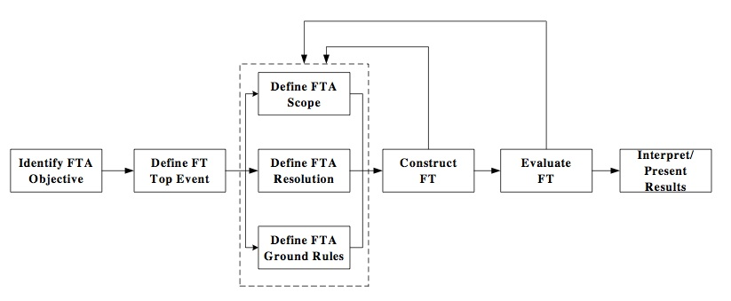

# Abstract

A review was conducted of literature relating to the social and environmental risks involved with groundwater and Coal Seam Gas operations. The review covers the current legislative approaches to the governance of risk within Australia, together with some international perspectives. However the review was conducted with the technical aim of generating system requirements for  risk governance.

# Purpose and Goals

Within the context of these goals, the purpose of this literature review then is to identify the appropriate requirements for an unconventional energy production risk governance information technology. Whilst the technology might be generically engineered to address risk governance over any environmental or technical asset, it is applied to a specific asset at risk which is groundwater. 

* Ability to translate different data models from vendor and non-vendor based systems into one system 
* Flexible schema to accommodate unstructured data (NoSQL)
* Able to accommodate data analysis of large data sets (BigData)
* Off-line field data entry
* Data-driven UI
* Visualisation of risks

# Introduction

In the last few years unconventional energy (UE) ^[Unconventional energy in the Australian context, generally refers to gas held in shale or coal formations (CSG), along with what is known as "tight gas" [@taylor_australias_2012, p.7].], including unconventional natural gas development (UNGD) [@werner_environmental_2015] production, has been considered a significant potential economic resource for Australia. However it is a potential that faces significant resource, market and environmental challenges [@mcdine_east_2015].

The potential benefits need to be placed within both financial and environmental risk contexts. The current economic context^[Recent market conditions of low oil prices and market failures in China have, for example, raised doubts over future CSG expansions and greenfields projects [@mchugh_lower_2015]. The CSG yearly reports all note the sensitivity of cash flows to global oil prices: "significant fall in oil price, if sustained at current levels, will result in lower growth in cash flow and earnings than previously expected" [@origin_energy_full_2015], "Sales revenue fell 19% on the corresponding quarter, affected by the lower realised oil price" [@santos_second_2015], "Revenue and other operating income decreased 19% to $2 557 million, reflecting significantly lower commodity prices, especially oil and liquids"[@bg-group_second_2015].] has created financial pressure to reduce costs associated with environmental risk compliance frameworks. As Brockett notes, industry has on-going calls for regulatory reforms to remove unnecessary costs whilst maintaining robust environmental protection and other obligations [@brockett_streamline_2014]. 

There are then, many different views on the risk posed by CSG. Environmental, hydrogeological, financial, economic and social risks make the topic of CSG regulation socially and ergonomically contested [@hunter_regulation_2011]. In this context this review does not seek to express an opinion on the riskiness of CSG operations, but rather to gather the requirements for a system that can reduce costs of capturing, monitoring, and governing risk data.

Of the challenges facing the UE industry the Committee for Economic Development of Australia (CEDA) report notes that property rights and water management are key issues [@taylor_australias_2012, p.5]. To address these issues various experts have recommended that UE companies and government agencies need to develop a robust independent risk management framework aimed at preventing potentially irreversible damage to environmental and hydrological systems [@beckers_groundwater_2013, @howe_framework_2010, @hunter_draft_2013, @davies_managing_2015]. These recommendations come in response to both legislative duplication, but also in response to computer and database systems that have grown incrementally in an ad-hoc manner without consideration for what might be called whole-of-system data requirements [@brockett_streamline_2014].

In Australia, the National Harmonized Regulatory Framework [@scer_national_2013], together with a number of subsequent reports attempted to address how all of the elements might fit together [@dnrm_coal_2013, @dnrm_activity_2013, @dnrm_storing_2015, @beckers_groundwater_2013, @qwc_underground_2012]. However experience shows that there are still some significant gaps in the system design. These are reviewed below to generate requirements specified in these publications with the aim of producing cost reductions for hydrogeological and environmental compliance.

# Method

The approach used here is to review the received literature with the aim to establish the technical requirements of a Risk Governance System (RGS), and evaluate some technologies which present viable solutions to meet these  requirements. As a result of this method each section will be summarized with a table documenting level 1-3 requirements derived from the cited literature.

# Generating requirements for risk governance

## Harmonized Regulatory Framework

The Harmonized Regulatory Framework (HRF) forms the context in which Government agencies have attempted to meet the challenges posed by the unconventional energy industry in Australia. The HRF emphasised that Governments at all levels have a key role in providing scientifically-robust information, but also in providing access to such information in a timely manner [@scer_national_2013, 10]. 

This information access aims to establish and maintain the industry’s Social License to Operate (SLO) [@boutilier_modelling_2011] and community confidence so that Australia and transnational corporate operators can gain economic benefit from any potential development [@scer_national_2013, 10]. The main concern in Coal Seam Gas operations is that they risk significant impacts on the environment and humans. 

At the legislative level, Randall proposed a model called the screening, pre-release testing and post-release surveillance (STS) model. 

Randall's model includes a depiction of the precautionary principle whereby at any phase, prohibition can apply to stop operations due to significant risk. Within the HRF, the precautionary principle in conjunction with adaptive management is part of a hierarchy of risk control measures that apply to all aspects of the development of natural gas from coals seams.

At the State Government level in Australia, Queensland has been a test case where Coal Seam Gas regulation and production have been pioneered. In addressing the Queensland context the HRF says that the policy focuses on the management and use of produced water under the Environmental Protection Act. Water, then, is one of the main focuses of the framework, and would be the main problem constext of any STS model.  

In this overview, data planning and collection along with risk communication are important components. The HRF therefore stipulate the requirement for a robust framework for data collection and transfer to monitor risks, and also to provide instruction on remedial actions [@scer_national_2013]. In this approach, defined trigger thresholds are used to initiate a make-good process [@ehp_underground_2010]. 

### Requirements - HRF

|level | definition                        | met by |    
|------|:---------------------------------| ------------------|
| 1    | Framework for water data collection and transfer to monitor Env & SLO risks | database + UI |
| 1    | Able to integrate STS | database + UI |
| 1    | Able to define trigger thresholds | database + UI |
| 1    | Able to track make-good process | database + UI |

## Feedback on HRF

A period of public feedback was undertaken as a part of the HRF. Some of the recommendations included that actions should be able to be taken at all levels for, and by, stakeholders across State or Federal (or even National) jurisdictions [@anedo_submission_2013], with the intent of affording a framework for harmonization^[Citing Hollander [-@hollander_rethinking_2009], and Leebron [-@leebron_claims_1996], Brockett defines harmonization as process of making regulatory requirements, from different jurisdictions, identical or similar through joint problem-solving mechanisms [@brockett_streamline_2014]] and co-development of procedures between State entities [@brockett_regulation_2014].

Hunter suggests that demonstrable scientific underpinnings of risk assessments would assist in communications (a component depicted in Fergusson's model) [@hunter_draft_2013]. Martin says that water allocation and licensing frameworks also need to be enhanced to include water that is produced, and consumed by UE producers [@taylor_australias_2012, p.5].

Taylor [@taylor_australias_2012, p.5] went on to suggest that where UE producers use water resources, they should carry the costs associated with any impacts from activities. This view concurs with the views of landholders, who wish to receive appropriate compensation and payments [@vff_public_2013]. 

Strict liability is the imposition of liability on a party without a finding of fault. The question is whether strict libability should be afforded to UE producers as the tortfeasor. In this context the NWC recommended that bonds and sureties should be used deal with uncertainty and the time frames associated with potential impacts [@nwc_coal_2010]. As the NWC noted, these time frames may potentially extend past 100 years, which is well-beyond the expected life-span of the CSG recovery process. This includes impacts such as long-term reductions in aquifer pressures or levels, and, "impacts on environmental assets that are not adequately protected by current ‘make good’ mechanisms" [@nwc_coal_2010].

### Requirements - HRF Feedback

|level | definition                        | met by |    
|------|:---------------------------------| ------------------|
| 1    | Data collection not limited to jurisdiction | cloud-based web application |
| 1    | Data transfer not limited to jurisdiction | cloud-based web application |
| 3    | Able to record stakeholders voice   | `schema: issues` |
| 3    | Able to record decision outcomes for stakeholders  | `schema: issues` |
| 3    | Track bonds and sureties per company and per asset/site | `schema: company&&site` |
| 3    | Track impacts not protected by current 'make good' mechanisms | `schema: site` |
| 3    | Able to track stop operations orders | `schema: site` |
| 3    | Able to store env. impact detection data | `schema: site`  |
| 3    | Able to store re-mediation actions data | `schema: site`  |
| 3    | Able to store make-good action/compensation data | `schema: site`  |
| 3    | Able to store links to scientific references | `schema: site`  |
| 3    | Able to store produced and consumed water | `schema: timeseries` |
| 3    | Able to store defined trigger thresholds used to initiate a make-good | `schema: site` |

## Risk Management

Generating requirements for a risk-governance system is a complex task, partly made complex by the variety of different approaches to risk from different industries and academic disciplines. For example different methods are applied in environmental policy [@ferguson_risk_1998], aerospace and systems engineering [@stamatelatosmichael_probabilistic_2011, @stamatelatos_fault_2002], or financial engineering [@lehner_finance_2014, @brandimarte_handbook_2014].

Whilst the domain of interest for this research is initially limited to water, there are downstream effects of water risks. For example, a compliance failure in with respects to water may have a financial impact on a CSG company (through a fine or make good liability). The downstream effect of the water risk then is a financial risk, which can impact cash flow or the Net Present Value of the operations. As a result, there can be many different approaches to the concept, and calculation of risk. 

The type of risk model depicted by Randall's diagram above forms the basis of what is called *Adaptive Risk Management* (ARM). As noted in the HRF, Queensland applies an adaptive management approach for environmental policy [@scer_national_2013]. Whilst it might be pragmatic to focus on the application of risk within the Queensland Groundwater CSG literature, the approach taken here is to review some aspects of other approaches with aim of potential novel integration in forthcoming works.

For ARM, on-going monitoring and communication is what makes the risk management adaptive. In other words, as soon as any impact is detected, appropriate action can be taken. However Swayne argues the QLD experience shows that ARM needs both KPI's, and needs to be integrated into statutory provisions with an appropriate decision-making framework, and that such a framework needs the flexibility to enable system changes in response to the improved knowledge of impacts [@swayne_regulating_2012].

Fergusson et al, diagram a general overview of the requirements of a risk system (shown below).

Fergusson et al start with suspicions about the riskiness of a system, and end with the communications of on-going risk assessments [@ferguson_risk_1998]. These are critical elements which in fact might be seen as part of each other when it comes to public perception and SLO. For Boudicca any risk assessment model needs to include a definition of ‘unacceptable impacts’, whereby projects deemed as having unacceptable impacts should be prohibited. Furthermore, verification should not rely on in-house representatives but rather only “independent third-party professional[s]” [@boudicca_lock_2013].

### Requirements - Risk Management 

|level | definition                        | met by |    
|------|:---------------------------------| ------------------|
| 1    | Able to track risks associated with operations | cloud-based web application |
| 1    | Able to communicate/visualise risks to stakeholders | cloud-based web application |
| 3    | Able to define and track unacceptable impacts to site | `schema: issues` |
| 3    | Able to define and track unacceptable impacts to aquifer | `schema: aquifer` |
| 3    | Able to define and track unacceptable impacts within catchment | `schema: catchment` |
| 3    | Verification that appraisals undertaken by independent third party | `schema: appraisals` |
| 3    | Able to define KPI's for ARM | `schema: appraisal` |
| 3    | Able to integrate with statutory provisions | `schema: appraisal` |
| 3    | Flexibility to enable changes in response to the improved knowledge of impacts | `schema: appraisal` |

## Compliance

In the Healthy Headwaters report Act 5, several topics were not included in the assessment of risk. Baseline Groundwater Quality was one of the topics  [@beckers_groundwater_2013, 6.1.3.1], however Baseline Assessments and Bore Assessments are an on-going compliance requirement for the CSG companies [@ehp_underground_2010]. The requirements for the Baseline Assessments are defined in [@ehp_baseline_2010] and typically include data such as water quality or water level, or might involve pump testing, on-going bore assessments relevant to SLO for example.

### Requirements - Compliance

|level | definition                        | met by |    
|------|:---------------------------------| ------------------|
| 3    | Able to store compliance data | `schema: site&&results`  |
| 3    | Able to store trigger thresholds used to initiate a make-good | `schema: site&&results` |
| 3    | Able to store make-good agreements | `schema: site&&makeGood` |

## Water Monitoring Strategy (WMS)

The WMS used in the Surat Underground Water Impact Report [@qwc_underground_2012] report had six objectives for a water monitoring strategy which are relevant to this project. 

### Requirements - WMS 

|level | definition                        | met by |    
|------|:---------------------------------| ------------------|
| 1    | Able to establish background trends | `schema: timeseries`  |
| 1    | Able to improve future groundwater flow modelling | `schema: timeseries` & interface with flow models |
| 1    | Able to improve understanding of connectivity between aquifers | `schema: aquifer`  |
| 3    | Able to identify changes in aquifer conditions within and near areas of petroleum development | `schema: site&&aquifer`  |
| 3    | Able to identify changes in aquifer conditions near critical groundwater use | `schema: site&&aquifer` |
| 3    | Able to identify changes in aquifer conditions near springs | `schema: site&&aquifer` |

## Springs

In addition to documenting risks associated with springs (detailed further below), the underground water impact report identified a number of areas that need to be accommodated. Specifically, knowledge gaps around, cultural heritage and fauna assessments, the understanding of connectivity between springs and aquifers, and the ecosystems and species at springs [@qwc_underground_2012]

### Requirements - Springs

| level | definition                        | met by |    
|------|:---------------------------------| ------------------|
| 3    | Able to acquire & store cultural heritage at springs | `schema: site` |
| 3    | Able to acquire & store fauna assessments at springs | `schema: ecology` |
| 3    | Able to acquire & store data on spring-aquifer connectivity | `schema: site&&aquifer` |
| 3    | Able to acquire & store data on ecosystems  | `schema: site&&ecology` |

## Summary

In reviewing the literature to generate system requirements, it appears that there are a number of different world views which might be loosely associated with different schemas. These world views tend to reflect the interests of different stakeholders. 

In terms of Systems Engineering, requirements are usually generated from a user. However in the case of the literature above, authors did not typically frame the discussion in terms of user requirements, but in terms of stakeholder interests. If the user is understood as a stakeholder, then the stakeholder requirements above can be defined as user requirements. However, as addressed in the systems engineering section below, this alignment itself creates another requirement concerning the issue of how to manage users. 

# Approaches to Risk

The concept of risk and risk management can hold different significance depending on worldview and perception. It can be perceived as acceptable or unacceptable, where the risk of an event for one person can outweigh any potential gains from that event as seen in the eyes of another person. There are many approaches to risk assessment in different industries, including methods for both qualitative and quantitative assessments. These different approaches to risk stem perhaps from different requirements. 

## Brief History 
Citing Grier, Covello and Mumpower claim that the concept of quantitative risk assessment first entered intellectual thought in the 4th century AD through Amobius's theological consideration of the risks posed to one's soul after death [@covello_risk_1985]. Covello and Mumpower say the 18th century saw a flourishing of probability risk analysis with a modern prototype developed by LaPlace in application to smallpox vaccination and morbidity probabilities, however before this there was almost no history of quantitative probability theory [@covello_risk_1985]. 

In environmental policy, Ferguson et al argue that the use of risk is relatively recent, aiming to avoid conflation of political and management goals with environmental objectives by providing an objective and scientific method [@ferguson_risk_1998, p.7]. In subsurface hydrology, Tartakovsky claims that probabilistic risk analysis (PRA) had not been used until 2007 [@tartakovsky_assessment_2013, p.248]. However, for all stakeholders, the notion of risk is not limited to quantitative methods. As Slovic [-@slovic_perception_1987] noted there is also concept of "riskiness" which can mean more to a stakeholder than a unidimensional measure of expected fatalities or failures, and might be called an intuitive assessment, which itself might have a longer history through the concept of 'common sense'. 

## Perceived Riskiness and Socail License to Operate - SLO

Riskiness, it might be said, is in the eye of the stakeholder, and as such open to many subjective factors which may, or may not be related to the best effort to quantize risk. Perceived riskiness can be related to a mismatch between expectations and perceptions [@williams_social_2013], and may operate as a surrogate for concerns that may not have a connection to a quantitative risk assessment, but are related to political or personal misgivings [@slovic_perception_1987]. 

Hence, whilst risk might be calculated as a probability (discussed below), as Ferguson et al note that risk perception can play a critical factor in influencing any decisions made. This is depicted in their diagram of risk assessment components reproduced below. 

This notion of riskiness has led to the concept of Social License to Operate (SLO) [@williams_social_2013, @gunningham_social_2004, @moffat_paths_2014], with an associated attempt to quantify and model such. SLO is itself the proposition that a society of stakeholders is able to grant or withdraw support for a company and its operations, and this in turn can present a significant risk to both companies, governments and community stakeholders as documented in many studies.

{Shell in Nigeria etc}.

There are then three risk factors which can effect the prospect of successful development and operation of a project or product: 

* Perceived riskiness 
* Quantitative risk assessment 
* Qualitative risk assessment

With that said, research conducted by [@siegrist_trust_2012] found a positive relationship between procedural fairness and public acceptance. Turner has also suggested that procedural fairness may the critical element for enabling trust in an authority [@turner_social_1991]. 

Form Moffat and Zhang the definition of trust should focus on reciprocity and benevolence [@moffat_paths_2014]. They hypothesized that trust is a critical pathway for the acceptance of an operation. In this hypothesis is contained a further corollary that procedures perceived as fair and contact that contains a forum in which concerns can be voiced, will enhance trust, thereby reducing the risk of a SLO withdrawal. 

It embodies the notion that  promotes cooperation [@moffat_paths_2014], {who cite De Cremer et al., 2005; Rawls, 2001; Tyler and Blader, 2000}. 

{But this pathway is continuous, dynamic measure...Need evidance.}

Whilst polls at a local council level can be an effective way of evaluating community sentiment towards a development such as CSG [@luke_developing_2013], these are typically one-shot mechanisms. Social media today, like facebook and twitter, are on-going mechanism for the expression of sentiment, and they, or similar mechanisms might be used to establish a dynamic measure of sentiment as a timeseries parameter.  

 
[] note that there are a number of qualitative indices which can be measured to accommodate the perception vs expectation ranking on issues such as, access to medical facilities, housing affordability and availability etc.

{The question of how to measure a stakeholder's perceived riskiness, not just concerned with trust and procedural fairness, but trust in the measure itself, the intended use of such a measure might concern a stakeholder, and in a way have a negative impact on trust. In this way, the measure, and the system needs to be independent, or stakeholder neutral. The issue here is how could such a system which attempts to visualize perceived risk, survive as a business model, without some revenue? Revenue or economic benefit is always a soruce of mistrust, trying to cook the books, or fake engagement for the sole purpose of extracting profit. }

Once a social license has been granted, there needs to be a way of tracking the match or mismatch expectated and percieved operations risk. 

### Requirements - Percieved riskiness

| level | definition                        | met by |    
|------|:---------------------------------| ------------------|
| 3    | Able to store social risk | `schema: risk` |
| 3    | Able to store perception vs expectation ranking | `schema: risk` |

## Quantitative Risk Assessment - QRA

Quantitative techniques are normally mathematically and/or computationally based [@baker_techniques_1998]. As noted by Ferguson et al, scientifically, Risk ($\mathit{\bar{R}}$) is defined as a combination of consequence and probability [-@ferguson_risk_1998]. This is typically calculated as the product of the Probability of some event X ($\mathit{P}(\mathit{X})$) and the Consequence ($\mathit{C}$) of that event occurring [@qwc_underground_2012, p.Apx-92].

$$ \begin{aligned}
     \mathit{ \bar{R} } = \mathit{P}(\mathit{X}) \bullet \mathit{C} \\
   \end{aligned}
$$ {#eq:risk}

There are many different types of approaches for constructing the computation, some of which produce different results however they may also have been designed for different purposes, and so are irreconcilable across study domains

### Requirements - QRA

| level | definition                        | met by |    
|------|:---------------------------------| ------------------|
| 3    | Able to store risk calculations | `schema: risk` |

## Groundwater Model and Multi-Criteria Analysis of Risk 

Activity-5 of the Healthy Headwaters report attempts to provide an approach to quantitative risk assessments for the purposes of evaluating impacts from CSG [@dnrm_activity_2013-1]. Activity-5 uses a combination of Groundwater Model and Multi-Criteria Analysis (GMMCA) [@dnrm_activity_2013-1, p.i].

The Healthy HeadWaters final report used a hybrid of indexing and quantitative methods known as MCA [@dnrm_activity_2013-1, p.32]. This method used Weights ($\mathit{Wt}$) to value perceived relative importance, with the weighting done by a panel of experts. Ranks ($\mathit{Rnk}$) are based on properties of the attributes ($\mathit{a}$) for example the  magnitude of draw-down, and can vary spatially ($\mathit{x,y,z}$). 

Whilst the load-resistor model may look at gross failures and the downstream risks, it does not typically address the pollution associated with such a failure. The Healthy Headwaters' Groundwater Risks Report identified two different nomenclatures for addressing pollution entering the environment - these are the Hazard model, and the "source–pathway–receptor" (SPR) model [@beckers_groundwater_2013, @holdgate_perspective_1979] ^[Holdgate also uses the "source-pathway-sink", or "source-pathway-target" terminology]. Beckers et al argue that these methods have an equivalent outcome [-@beckers_groundwater_2013, p.28]. 

selected attributes for source (hazard), pathway (vulnerability) and receptor (consequence) 

$$ \begin{aligned}
     \mathit{Vulnerability} = \sum_{a} \mathit{V}(\mathit{x},\mathit{y},\mathit{z})_{a} = \sum_{a} \mathit{W} \mathit{t}_{a} \bullet \mathit{Rnk}(\mathit{x},\mathit{y},\mathit{z})_{a} \\
   \end{aligned}
$$ {#eq:vulnerability}

$$ \begin{aligned}
     \mathit{Consequence} = \sum_{a} \mathit{C}(\mathit{x},\mathit{y},\mathit{z})_{a} = \sum_{a} \mathit{W} \mathit{t}_{a} \bullet \mathit{Rnk}(\mathit{x},\mathit{y},\mathit{z})_{a} \\
   \end{aligned}
$$ {#eq:consequence}

##### Hazard Model

In terms of the Hazard model, Risk is defined in terms of hazards ($\mathit{H}$), vulnerability ($\mathit{V}$), and consequence, ($\mathit{C}$).  

$$ \begin{aligned}
     \mathit{ \bar{R} } = \mathit{H} \bullet \mathit{V} \bullet \mathit{C} \\
   \end{aligned}
$$ {#eq:risk_hazard}

##### SPR Model

For the SPR model,  

[narayan_holistic_2012]

 is in terms of the concept of 'receptor'.

With Receptor ($\mathit{r}$), pathway  ($\mathit{p}$), and source ($\mathit{S}$).  

$$ \begin{aligned}
     \mathit{ \bar{R} } = \mathit{S} \bullet \mathit{r} \bullet \mathit{p} \\
   \end{aligned}
$$ {#eq:risk_receptor}

### Requirements - GMMCA

| level | definition                        | met by |    
|------|:---------------------------------| ------------------|
| 3    | | |

## Probabilistic Risk Assessment - Fault Tree Analysis

In contrast to the GMMCA approach used in Activity-5 detailed above, Terskesi adopts the approach to risk which is typically used in Systems Engineering. In Systems Engineering, the standard quantitative calculation of Risk ($\mathit{\bar{R}}$) is probabilistic, known as Probabilistic Risk Assessment (PRA): 

> *a comprehensive, structured, and logical analysis method aimed at identifying and assessing risks in complex technological systems for the purpose of cost-effectively improving their safety and performance*  [@stamatelatosmichael_probabilistic_2011].   

The selection of a likelihood function may be done by different methods:

* Poisson - counts of failures during operation
* Bernoulli - counts of failures on system demands
* Expert estimate - a best estimate (based on MIL-STD-217) where the lognormal distribution is a common likelihood function.

The posterior distribution

(T)k T Pr(kT,) k! e
(5-6)

[@stamatelatosmichael_probabilistic_2011, p.5-11]

which gives the probability of observing k events (e.g., number of failures of a component) in T units of time (e.g., cumulative operating time of the component), given that the rate of occurrence of the event (failure rate) is  

Fault tree analysis is typically undertaken using Boolean logic to generate a probability of failure of a system.

As a formal method Probability Risk Analyses (PRA) was developed in detail during the 1960's and the 1980's with the U.S. aerospace and missile programs, and the U.S. nuclear industry. Fault Tree Analysis (FTA) is one example of PRA and is typically applied in mechanical and electrical systems engineering projects where the system is well-defined [@stamatelatosmichael_probabilistic_2011, p.5-11].  

Stamatelatos et al depict the interrelationship of eight steps involved in FTA through the following non-linear diagram. The top event defines the failure mode of the system that will be analyzed, for example, benign shut-down of an engine.

For a given mission there may be several objectives. For example, no loss of vehicle (LOV), loss of crew (LOC) or loss of mission (LOM). In the case of groundwater, the mission might be lost of utility (LOU). 

[tartakovsky_probabilistic_2007]. 

constructing a fault tree (Figure 1), which relates the occurrence of the system failure, i.e., aquifer contamination, to the failures of its constitutive parts (basic events), i.e., the occurrence of a spill, the failure of natural attenuation, and the failure of a remediation effort.

### Requirements - FTA

| level | definition                        | met by |    
|------|:---------------------------------| ------------------|
| 3    | | |

## Markov Chain Monte Carlo and Bayesian Risk (MCMC)

In financial engineering Markov Chain Monte Carlo and Bayesian Statistics are applied to risk estimations, where,  "MCMC methods are indirect sampling strategies, based on the simulation of a Markov process, whose long-run state density is the target density" [@brandimarte_handbook_2014, p.631].

MCMC methods involve a system of linear equations, 

### Requirements - Financial Risk

| level | definition                        | met by |    
|------|:---------------------------------| ------------------|
| 3    | Ability to accommodate MCMC analysis | algorithm services and risk schema |

## Hazards - Attributes and for Risk Factors

DNRM Activity-5 identified 7 attributes for tracking risk factors; Drawdown, Gas migration potential, Geological pathways (formation overlap and orientation), Wellbore pathways (bore depth and age), Aquifer storage (available head), Groundwater users (bore density, allocation volumes and purpose),  Spring conservation, location rankings and source aquifer.

Most significant effect related to CSG development. Accounts for the aquifers proximity to the coal measures, aquifer hydraulic properties and aquifer inter-connectedness (aquitard properties) |

### Requirements - Hazards

| level | definition                        | met by |    
|------|:---------------------------------| ------------------|
| 3    | Water use intensity ranking values |  |
| 3    | Able to store and track hazard attributes and risk factors |  `schema: risk`  |

## Qualitative Risk Assessment 

Qualitative assessments of risk are typically based on expert opinion. Risk is assigned in relative terms based on the expert's estimation [@beckers_groundwater_2013]. Risk is described as low-high, and the assignment of the consequence a best estimate. Baker et al. note that this method of assessment is inclined to be subjective and so suggest that they may lead to inconsistencies and non-repeatable outcomes [@baker_techniques_1998]. 

Even though the qualitative assessments of risk might be undertaken by experts, due to the subjectiveness, and inconsistency, the assessments might, in turn be perceived as falling into the same category as Perceived Riskiness. Subsequently stakeholders may be inclined to question of the value of the qualitative risk assessment, a situation which might be exasperated when two equally recognised experts have a difference of opinion over the risk.

Risk management is a necessary addition to the precautionary principle. The application of the precautionary principle should be a proportionate and reasonable response to:

* the level of potential impact (e.g. the principle is most applicable to potential catastrophic or irreversible harm)
* the likelihood of a potential impact occurring (is the risk plausible and reasonably likely to occur)
* the costs of regulatory action, and the opportunity cost of not proceeding [@scer_national_2013,14]

In general, most observers would be happy with the notion that Risk is a spectrum. Any particular event might be classed anywhere between low or negligible risk, and high risk, or catastrophic. 

When an event is contentious it is generally the evaluation or perception of the risk and the risk assessment methodology used which is at moot. Notwithstanding the amount of time embodied in making a risk assessment, when two or more subject experts have a significant disagreement in their risk assessment, producing apparently contradictory assessments, the value of the risk assessement procedure itself appears to become nullified. 

In the context of conflicting risk assessments, the default position for a non-expert stakeholder can be to assign the process with a high risk status, with conspiracy theories, and conflict of interest claims under dispute. 

How might the risk assessement methodology be operationalised for Governance purposes?

It can also be noted that whilst the ARM approach identified in the Framework is concerned with risk of impacts on water resources, the same concept might also be used with respects to SLO. This is because community concerns that go unaddressed can result in the withdrawl of SLO. This itself may pose a significant risk factor to the operator. 

These considerations suggest that, just as the water level in a bore might change in respose to pumping, SLOR (Social Licence to Operate Risk) is dynamic and changes over time in response to information and operations. Hence SLOR can be considered within scope for the data transfer and monitoring system under investigation. That is, can the Social Risk, together with the Technical Risk of Operations in Unconventional Energy be monitored at the same time?

### Requirements - Qualitative Risk Assessment

| level | definition                        | met by |    
|------|:---------------------------------| ------------------|
| 3    | | |

## Connectivity Risk Assessment (CRA)

The Spring Connectivity risk assessment contained in the Underground Water Impact Report (UWIR) can be considered a type of qualitative risk assessment [@qwc_underground_2012, p.78]. Risk was defined quantitatively in terms of 

And risk $\mathit{ \bar{R} }$, is then defined as:
$$
\begin{equation}\label{eq:test1}
  a=b
\end{equation}
$$
$\eqref{eq:test1}$
$$ 
    \mathit{\bar{R}} = 1 - \mathit{R} 
$$ \eqref{eq:test2}

\ref{eq:risk}
$\ref{eq:risk}$
$\ref{#eq:risk}$ . 
$ \eqref{eq:risk} $ 
\eqref{eq:risk} 

a risk level between 1 (lower) and 5 (higher) was assigned on the basis of the 

Risk was defined 

 into 
likelihood of there being reductions in the flow of water at the spring and the consequences on known spring values if a reduction in flow was to occur.

Three equally weighted criteria were used to assess the likelihood of there being reductions in the flow of water to a spring. The criteria used are as follows:
L1: The magnitude of the predicted impact of groundwater levels
The magnitude of the lowering of groundwater levels in the aquifer feeding the spring was assessed using the Commission’s regional groundwater model.
L2: The distance from the spring to petroleum development
This deals with the possibility that near areas of petroleum and gas development where drawdown in coal measures is large, flow to springs could be controlled by local geological features that are not explicitly reflected in the regional groundwater flow model.
L3: The stratigraphic (vertical) proximity of the source aquifer to the target petroleum formation.
This deals with the interconnectivity between aquifers. A spring with a source aquifer stratigraphically close to a target petroleum and gas formation is more likely to be affected than a spring in an aquifer that is stratigraphically more remote.

In addition to the risks to springs, the connectivity 
o improving understanding of the connectivity of springs to aquifers; and
o improving understanding of the ecophysical relationships of endemic species at springs.

### Requirements - CRA

| level | definition                        | met by |    
|------|:---------------------------------| ------------------|
| 3    | Able to acquire & store cultural heritage at springs | `schema: site` |
| 3    | Able to acquire & store fauna assessments at springs | `schema: fauna` |

## Hydrosystems Risk

In hydsrosystems risk and reliability analysis is commonly used in dam engineering [@goodarzi_introduction_2013, @mays_water_2010]. Gregory and Baecher argue that in civil and security issues, Event Tree Analysis (ETA) is preferred to FTA for calculating risk [@gregory_b_baecher_risk_2004]. 

Here, the same initial hazard identification step is undertaken as with the qualitative analysis given above.

A reliability analysis aims to find the time ($\mathit{t}$), when a system is likely to fail. Under conditions where piping, tank and tap don't fail, the supply will always meet demand when a tap is turned on, unless the tank is dry.

The next step is to introduce and quantify the probability of the risk.

Resistance (*r*) and load (*l*) are two central concepts to the definition of risk and reliability in this context. ^[Mays notes that structural engineers might be more familiar with the concepts of *strength* and *stress* respectively.] Resistance is defined as the ability of a system component to meet it's designed purpose without failure when subjected to an external load. Load might be a mechanical or other forcing stress.
 
In this context, risk is then defined as the probability of the load exceeding the resistance - the probability of failure. Reliability is the inverse. That is, the probability of the resistance exceeding the load - the probability of survival [@mays_water_2010, p.387].

Where $\mathit{r}$ = resistance and $\mathit{l}$ = load, reliability ( $\mathit{R}$ ) is then defined as: 

$$ 
\mathit{R} = \mathit{P}( \mathit{r} > \mathit{l} ) = \mathit{P}( \mathit{r} - \mathit{l} > 0 ) 
$$ \eqref{eq:probability}

And risk $\mathit{ \bar{R} }$, is then defined as:

$$ 
    \mathit{\bar{R}} = 1 - \mathit{R} 
$$ \eqref{eq:reliability}

#### Equivalence of risk

Even though the four different equations given above all refer to risk is it the case that they have a formal equivalence? THis is to ask whether the following relation holds:

$$ 
\mathit{R} = 1 - \mathit{R} = \mathit{S} \bullet \mathit{r} \bullet \mathit{p} = \mathit{H} \bullet \mathit{V} \bullet \mathit{C} = \mathit{P}(\mathit{X}) \bullet \mathit{C}    
$$ \eqref{eq:equivalence}

# System Engineering

## Scope

Fergusson's figure given above can be used to depict the main scope for the systems engineering effort.

As shown, both data capture and visualisation define the scope. Within this scope five  different users classes (or stakeholder types) can be identified:

**Stakeholder Types**

* Regulator
* Proponent/Lease holder
* Service providers
* Landholder
* Public

Service providers can be understood as companies or individuals that provide field or laboratory data to a stakeholder (proponent, regulator, landholder, etc). Regulators can be at any level of governance, local, State, federal. These different user classes are defined within the system by permissions to see, enter and edit data. 

These permissions have not been identified in any of the requirements generated above. The process of identifying appropriate permissions may be accommodated either through a consultative process with the different stakeholders, or engineered into a high-level administrative user class who is able to define permissions for all stakeholders dynamically.

## Work Breakdown Structure (WBS)

In identifying the requirement for a risk governance system above the next question is how to implement such. Systems Engineering is a process used for developing a system with moderate to high complexity [@kossiakoff_systems_2002, @lightsey_systems_2001, @clark_system_2009, @rook_controlling_1986, @mooz_visualizing_1997, @mooz_4.4.3_2001, @estefan_survey_2007]. 

This type of approach makes for a different concept of Work Breakdown Structure (WBS) as a means of organizing system development [@lightsey_systems_2001, p.85]. Typically the WBS is used to define the total system, to display it as a product-oriented family tree composed of hardware and software. Until relatively recently, data planning part of the WBS was conducted under the assumption of an RDBS (relational database management system), with a desktop-server model of deployment. This required careful planning of data model, schemas, fields and validation requirements. 

If such a WBS procedure was undertaken by a business consultant it could typically culminate in a data dictionary as the deliverable product. In the case of CSG in Queensland, the deliverables were a data dictionary and database file format for transferring data to the regulator [@dnrm_storing_2015].^[These formed the backbone of the data capture element of the policy framework for establishing baselines.]

A risk governance system is a complex system, however the requirements for integrating ARM and multiple data models of legacy vendor-systems, as noted above, provide for a novel engineering concept that is more reactive by design, accommodating data unstructured by any particular legacy data model.

In reactive engineering, changes in data requirements will automatically propagate throughout the User Interface [@czaplicki_asynchronous_2013, @wikipedia_reactive_2015, @facebook_javascript_2015]. When the the product has emergent data and UI requirements built into the design the traditional WBS isn't necessarily a good fit for the development method. 

Hence as Shin and Kim observe, the challenge now is how to migrate data from the legacy RDBMS systems to NoSQL systems but also adapting software applications to communicate properly with the new database model [@shin_utilization_2015]. In some cases this will not be possible due to the age of the legacy systems, and in this context new typically web-based technologies can meet these requirements. In particular, NoSQL, Bigdata systems, like MongoDB, and data-driven scripting solutions such as fastn.js (a local software solution produced in Queensland). These technologies have sufficient flexibility so as to be able to accommodate further requirements for monitoring both technical risk and SLOR. 

To accommodate the requirement for migrating from a RDBMS data mode to a NoSQL system, Shin and Kim produced a NoSQLayer to perform all data migration [@shin_utilization_2015]. Whilst this is appropriate for a 1..1 migration (1 data model to 1 NoSQL system), the migration becomes more complex when it is an n..1 migration. That is there are many database models to be migrated to one NoSQL system. This is the case with the regulatory environment in QLD regarding CSG data. As a result, translation and meta-translation layers are required for model-matching and translation-matching. In this thesis this is explored with the benefit of recently developments in server-side javaScript (Node.js).

, the entire structure of the original database is maintained and being all data stored as a NoSQL model.

This thesis addresses the same problem, however it is more complex given the additional requirement for a meta-translation between data models of the legacy systems.

The promise of these systems is that they are both flexible, but don't require the same level of resources that were required by the legacy systems in order to produce a system that meets user requirements.

### Requirements - WBS

|level | definition                        | met by |    
|------|:---------------------------------| ------------------|
| 3    | Able to accommodate multiple data models and large (big-data) datasets | NoSQL application |
| 3    | Able to accommodate emergent requirements from ARM  | NoSQL application |
| 1    | Data-driven reactive user interface   | data-driven ui scripting library (fastn.js/Angular.js/reactive.js) |

## Data planning and collection for unstructured data ^[The author has had the privilege to have work with one of the Queensland CSG companies where he acted as a technical database expert. From those experiences the following technical observations are made.]

### Industry experience

In a number of industry-based community of experts meetings, the CSG database technicians met to discuss and identify difficulties that were common amongst all of the CSG proponents. These ranged from the actual data transfer technology (Dropbox/DVD/etc.), novel water quality parameter names and data standards. Without going through each company's experience in detail, in general it can be said that whilst legacy database technologies work well for relational data, the data compliance requirements for Coal Seam Gas proponents typically need to capture large amounts of unstructured data from the field that is not only associated with water data but with environmental compliance also.

the inflexibility of data models becomes a con with 
unstructured data and large data sets.

The research project was directly motivated from these experiences, with the aim to evaluate new technologies in their capacity to meet the technical requirements, social license to operate and environmental compliance obligations in the Unconventional Energy Industry.

Other issues faced during the author's industry experience were around off line data capture from forms in remote locations. Data from different laboratories, along with the visualisation of risk.

Typically the types of database applications available for a CSG company to accommodate groundwater data requirements are off-the-shelf systems which use a variety of relational databases. 

The requirements for handling unstructured data and massive storage have shown limitations to the traditional relational database models. These are the types of documents which are required in the Unconventional Energy Industry, to capture:

the inflexibility, technical limitations, are costly and time consuming to enhance, making them ill-equipped to meet the emergent requirements of the Unconventional Energy production sector. Emergent database requirements tend to be the norm rather than the exception in unconventional energy contexts. 

The legacy systems don't have the requisite variety in their ability to store data required for compliance purposes. This problem is not unique to unconventional energy production and has also been observed in a disaster management context. As Shin and Kim note, NoSQL systems have been designed to meet this business needs to accommodate very large unstructured data sets [@shin_utilization_2015]. Again, during the author's employment within the CSG industry, the ICT team, along with the author, identified several emerging NoSQL technologies which appeared to satisfy the technical solutions for the problems noted above. Among these technologies were MongoDB, and Hadoop.

The research scope for this project has been identified through three  domains: 

* Hazard or risk
* Data capture
* Communication (identified through professional experience)

Within these domains the author has direct industry experience with data capture and communication and these experiences are used to 

With respects to the data planning phase depicted in Fergusson et al, for water resources data and CSG and unconventional energy production, the main planning strategy used by the regulator was for the regulator to make a compliance requirement for the collection of data. As noted by [@qwc_underground_2012], CSG proponents were deemed responsible for implementing various components of the WMS, such as; 

* overseeing the collection of data in the field and laboratory
* either by contractors or in-house
* for quality assuring the data 
* and for installing a database system capable of accommodating the data for analysis and transfer to the regulator

This model had challenges in meeting many of the higher level requirements noted above. Significant issues were;

* not limiting data operations to jurisdiction
* adding new and unstructured data elements to the applications data model

The requirement for capturing unstructured data is a challenge that has been met by recent database technologies. Unstructured data is data that does not have a pre-defined data model. This is typically referred to emergent data requirements. It is typically text-heavy, but may contain data such as dates, numbers, and facts as well. In fact, many of the legacy, vendor-based water database applications were not designed to accommodate the data requirements and needed enhancements typically in the range of $100,000-300,000, not including installation.

In addition to the basic regulatory requirements to transfer and collect data, companies themselves had internal requirements to create internal reporting and monitoring tools which could help in the operational matters and in communicating with stakeholders. 

In particular, a company may have interest to estimate the NPV of an unconventional resource in the context of a high-risk operating environment with potential for revocation of social license through impacts on the livelihoods of local communities, or through compliance risks and impacts on the environment. These types of risks typically cross several departments within a company making customised database integration a key, but costly exercise. It was found that the legacy system, whilst flexible and powerful, was unable to meet all of the company's requirements. 

During the author's employment a legacy data system was used in the attempt to meet the regulatory requirements to capture and transfer baseline, and on-going water monitoring data to the regulator. The system was not designed with the flexibility to accommodate the unstructured data requirements, and several issues emerged which made integration between other internal systems a complex and costly project. 

### Requirements - Data capture

|level | definition                        | met by |    
|------|:---------------------------------| ------------------|
| 1    | Able to add unstructured data on add-hoc basis | NoSQL application |
| 1    | Data transfer not limited to jurisdiction | cloud-based web application |

## Risk Visualisation and Communication (RVC)

In NSW, the Chief Scientist’s report made a number of recommendations [@okane_independent_2014]. A primary recommendation was to establish a system enabling
high levels of transparency for the maintenance of "reliable, complete, current and authoritative data on all aspects of CSG and having this data held in a central, comprehensive, spatially-enabled, open, whole-of-environment data repository" [@brockett_regulation_2014, p.iv]. O'kane, also noted that big data technologies should be exploited for data analysis [@okane_independent_2014, p.11]. 

### Requirements - RVC

|level | definition                        | met by |    
|------|:---------------------------------| ------------------|
| 1    | Provide reliable, complete & current data | mobile and desktop access |
| 1    | Data held in a central repository | cloud-based database |
| 1    | Makes use of Big Data systems | cloud-based bigdata (MongoDB-Hadoop/AWS tools) |
| 1    | Able to provide transparency in risk data to appropriate stakeholders | database Permissions |
| 1    | Able to provide spatial data to appropriate stakeholders | web-based mapping and layers |
| 1    | Able to capture stakeholder approval of company on SLO pyramid | web-based mapping and layers |
| 1    | Able to capture and store assessment data to be entered in remote locations without mobile phone access by appropriately qualified staff | web-based mapping and layers |
| 1    | Able to transfer data to regulator in required format | web-based mapping and layers |

# Conclusions

This literature review aimed to gather requirements for a system of risk Governance by addressing current literature and methods of risk analysis and governance. At a high level it can be said that there are a large and complex number of requirements. The requirements are varied and dynamic such that they change over time with emergent requirements generated as new information and data is collected and new questions are generated.

That the dynamic nature of social license to operate and perceived risk, seems to mean that risk governance is not a "one-shot" assessment system. This is to say that one cannot just do an expert "risk assessment", and then expect operations to have achieved an on-going social licence for an operational life-cycle, or to have achieved environmental compliance. 

Rather, at any point in the life-cycle of an operation, social licence can be withdrawn regardless of an initial risk impact assessment. Hence, risk needs to be an on-going monitoring mechanism. This seems to generate a requirement for conceiving risks as time-series parameters, with assessment and monitoring over time. 

As noted above, industry experience shows that few pre-existing vendor-based legacy systems meet all data requirements. However BigData, along with NoSQL technologies are well-positioned to be able to meet the requirement of accommodating unstructured data, together with data transfer requirements from the regulators in the form of pre-existing data dictionaries, pre-existing data models of vendor-based legacy systems, and the requirement for a dynamic data-model which is responsive to changing requirements. 

Perhaps final question is around off-line data entry for a mobile workforce together with data-driven UIs which can meet a dynamic and immediate release cycle at low or no cost. This is rather than be constrained to a pre-existing data model or costly release cycle from legacy systems. 

This notion of risk as a time-series parameter, entails that the parameter itself can be perceived and interpreted which may raise other risks and misinterpretations, however the absence of the parameter. From this conception of risk, the requirement for a visualisation system can be derived, and the development of such a tracking system is the focus of the research component of this PhD project.

In summary, level 1-3 requirements were derived from the cited literature. It is anticipated that further decomposition into level 4-5 requirements will be undertaken in subsequent research, together with research into novel data-driven UI, and interfacing such with dynamic data models.
 
# Requirements

# References

