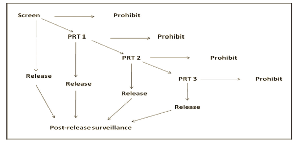

# Abstract

A review was conducted of literature relating to the social and environmental risks involved with groundwater and Coal Seam Gas operations. The review covers the current legislative approaches to the governance of risk within Australia, together with some international perspectives. However the review was conducted with the technical aim of generating system requirements for  risk governance.

# Purpose and Goals

Within the context of these goals, the purpose of this literature review then is to identify the appropriate requirements for an unconventional energy production risk governance information technology. Whilst the technology might be generically engineered to address risk governance over any environmental or technical asset, it is applied to a specific asset at risk which is groundwater. 

* Ability to translate different data models from vendor and non-vendor based systems into one system 
* Flexible schema and can accommodate unstructured data (NoSQL)
* Off-line field data entry
* Data-driven UI
* Visualisation of risks

# Introduction

In the last few years unconventional energy (UE) production has been considered a significant potential economic resource for Australia. Unconventional energy in the Australian context, generally refers to gas held in shale or coal formations, along with what is known as "tight gas" [@taylor_australias_2012, p.7]. 

In the Committee for Economic Development of Australia (CEDA) report Professor Martin notes that property rights and water management are key issues for unconventional energy production [@taylor_australias_2012, p.5]. 

These views form the context of this research. There is cross-sector support for a framework which integrates both precautionary methods and surveillance [@beckers_groundwater_2013, @howe_framework_2010, @hunter_draft_2013] 

In Australia, this momentum has culminated in the National Harmonized Regulatory Framework [@scer_national_2013], together with a number of reports on the ability to assess and monitor the risks, and cumulative risks, associated with Coal Seam Gas production. 

# Method

The approach used here is to review the received literature with the aim to establish the technical requirements of a Risk Governance System (RGS), and evaluate some technologies which present viable solutions to meet these  requirements. 

As a result of this method each section will be summarized with a short table  documenting the type of fields and inputs required by the system to capture the information needed from a governance perspective.

# Harmonized Regulatory Framework - Generating requirements for risk governance

The Harmonized Regulatory Framework (HRF) forms the context in which Government agencies have attempted to meet the challenges posed by the unconventional energy industry in Australia. The HRF emphasised that Governments at all levels have a key role in providing scientifically-robust information, but also in providing access to such information in a timely manner [@scer_national_2013, 10]. 

This information access aims to establish and maintain the industry’s Social License to Operate (SLO) [@boutilier_modelling_2011] and community confidence so that Australia and transnational corporate operators can gain economic benefit from any potential development [@scer_national_2013, 10]. 

At the legislative level, Randall, for example proposed a screening, pre-release testing and post-release surveillance (STS). 

Randall's model includes a depiction of the precautionary principle whereby at any phase, prohibition can apply to stop operations due to significant risk. 

At the State Government level in Australia, Queensland has been a test case where Coal Seam Gas regulation and production have been pioneered. In addressing the Queensland context the HRF says that the policy focuses on the management and use of produced water under the Environmental Protection Act [@scer_national_2013]. The HRF stipulates the requirement for a robust framework for data collection and transfer, to monitor risks, but also provide instruction on remedial actions. 
This type of model forms the basis of what is also called *Adaptive Risk Management* (ARM). As noted in the HRF, Queensland applies an adaptive management approach [@scer_national_2013]. On-going monitoring and communication is what makes the risk management adaptive. In other words, as soon as any impact is detected, appropriate action can be taken. In this approach, defined trigger thresholds are used to initiate the make-good process [@scer_national_2013, p.47, @ehp_underground_2010]. Fergusson et al diagrammed the components of an adaptive risk management framework [@ferguson_risk_1998]. 

As suggested by some stakeholders, such a action should have the option to be taken at all levels for, and by stakeholders across State or Federal (or even National) jurisdictions [@anedo_submission_2013]. Hunter suggests that demonstrable scientific underpinnings of risk assessments would assist in the communications component depicted in Fergusson's model. [@hunter_draft_2013]. 

Martin notes that property rights and water management are key issues for unconventional energy production [@taylor_australias_2012, p.5]. For water management specifically, Martin recommended that: 

* Water allocation and licensing frameworks needed to be enhanced to include water that is produced, and consumed by UE producers 
* UE producers need to develop a robust risk management framework with strong precautionary principles due to the potential for irreversible damage to environmental systems, including hydrological systems

###### Requirements - HRF

(@) `Requirement - Non-jurisdictional limited data collection`

(@) `Requirement - Non-jurisdictional limited data transfer`

(@) `Requirement - Ability to store impact detection data`

(@) `Requirement - Ability to store remediation actions`

(@) `Requirement - Ability to store make-good actions`

(@) `Requirement - Ability to link scientific references`

Fergusson et al, depict this general situation with a diagram starting with suspicions about the riskiness of a system, and ending with the communications of on-going risk assessments (see below).

{precautionary principle in conjunction with adaptive management is part of a hierarchy of risk control measures that apply to all aspects of the development of natural gas from coals seams.
}

From this general model,  

##### Intentions - HRF

| Description                                        |
|:---------------------------------------------------| 
| Provide the ability to record stakeholders voice   |
| Log impact of stakeholder voice on decision-making |

# Data planning and collection ^[The author has had the privilege to have work with one of the Queensland CSG companies where he acted as a technical database expert. From those experiences the following technical observations are made.]

Until relatively recently, data planning for risk was conducted under the assumption of an RDBS (relational database management system). This required careful planning of data model, schemas, fields and validation requirements. If such a procedure was undertaken by a business consultant it could typically culminate in a data dictionary as the deliverable product. In the case of CSG in Queensland, the deliverables were a data dictionary and database file format for transferring data to the regulator [@mines_storing_2015]. These formed the backbone of the data capture element of the policy framework for establishing baselines.

In addition to the basic regulatory requirements to transfer and collect data, the company itself had requirements to create internal reporting and monitoring tools which could help in the operational matters and in communicating with stakeholders. 

In particular, a company will have interest to estimate the NPV of an unconventional resource in the context of a high-risk operating environment with potential for revocation of social license through impacts on the livelihoods of local communities, or through compliance risks and impacts on the environment. These types of risks typically cross several departments within a company making customised database integration a key, but costly exercise. It was found that the legacy system, whilst flexible and powerful, was unable to meet all of the company's requirements. 

During the author's employment a legacy data system was used in the attempt to meet the regulatory requirements to capture and transfer baseline, and on-going water monitoring data to the regulator. The system was not designed with the flexibility to accommodate the data requirements, and several issues emerged which made integration between other internal systems a complex and costly project. 

In a number of industry-based community of experts meetings, the CSG database technicians met to discuss and identify difficulties that were common amongst all of the CSG proponents. These ranged from the actual data transfer technology (Dropbox/DVD/etc.), novel water quality parameter names and data standards. Without going through each company's experience in detail, in general it can be said that whilst legacy database technologies work well for relational data, the data compliance requirements for Coal Seam Gas proponents typically need to capture large amounts of unstructured data from the field that is not only associated with water data but with environmental compliance also.

the inflexibility of data models becomes a con with 
unstructured data and large data sets.

Typically the types of database applications available for a CSG company to accommodate groundwater data requirements are off-the-shelf systems which use a variety of relational databases. 

The requirements for handling unstructured data and massive storage have shown limitations to the traditional relational database models. These are the types of documents which are required in the Unconventional Energy Industry, to capture:

the inflexibility, technical limitations, are costly and time consuming to enhance, making them ill-equipped to meet the emergent requirements of the Unconventional Energy production sector. 

The legacy systems don't have the requisite variety in their ability to store data required for compliance purposes. This problem is not unique to unconventional energy production and has also been observed in a disaster management context. As Shin and Kim note, NoSQL systems have been designed to meet this business needs to accommodate very large unstructured data sets [@shin_utilization_2015]. Again, during the author's employment within the CSG industry, the ICT team, along with the author, identified several emerging NoSQL technologies which appeared to satisfy the technical solutions for the problems noted above. 

# Risk and Riskiness

Citing Grier, Covello and Mumpower claim that the concept of quantitative risk assessment first entered intellectual thought in the 4th century AD through Amobius's theological consideration of the risks posed to one's soul after death [@covello_risk_1985]. Covello and Mumpower say the 18th century saw a flourishing of probability risk analysis with a modern prototype developed by LaPlace in application to smallpox vaccination and morbidity probabilities, however before this there was almost no history of quantitative probability theory [@covello_risk_1985]. 

The concept of risk and risk management can hold different significance depending on worldview and perception. It can be perceived as acceptable or unacceptable, where the risk of an event for one person can outweigh any potential gains from that event as seen in the eyes of another person. There are many approaches to risk assessment in different industries, including methods for both qualitative and quantitative assessments. Those relevant to subsurface hydrology are reviewed below, however the notion of risk is not limited to these methods for all stakeholders. 

As Slovic [-@slovic_perception_1987] noted there is a concept of "riskiness" which can mean more to a stakeholder than a unidimensional measure of expected fatalities or failures. 

Riskiness can be related to a mismatch between expectations and perceptions [@williams_social_2013], and may operate as a surrogate for concerns that may not have a connection to a quantitative risk assessment, but are related to political or personal misgivings [@slovic_perception_1987]. Hence, whilst risk might be calculated as a probability (discussed below), as Ferguson et al note that risk perception can play a critical factor in influencing any decisions made. This is depicted in their diagram of risk assessment components reproduced below. 

Ferguson et al's figure shows that stakeholders 

This notion of riskiness has led to the concept of Social License to Operate (SLO) [@williams_social_2013, @gunningham_social_2004, @moffat_paths_2014], with an associated attempt to quantify and model such. SLO is itself the proposition that a society of stakeholders is able to grant or withdraw support for a company and its operations, and this in turn can present a significant risk to both companies, governments and community stakeholders as documented in many studies.

{Shell in Nigeria etc}.

There are then three risk factors which can effect the prospect of successful development and operation of a project or product: 

* Perceived riskiness 
* Quantitative risk assessment 
* Qualitative risk assessment

In review, all of these will be selectively read with the aim stated above, to capture requirements for a information system that enables the visualization each of these risk factors.

## Perceived Riskiness

Riskiness, it might be said, is in the eye of the stakeholder, and as such open to many subjective factors which may, or may not be related to the best effort to quantize risk {quote from above}. With that said, research conducted by [@siegrist_trust_2012] found a positive relationship between procedural fairness and public acceptance. Turner has also suggested that procedural fairness may the critical element for enabling trust in an authority [@turner_social_1991]. As Moffat and Zhang note, this definition of trust focuses on reciprocity and benevolence [@moffat_paths_2014]. They hypothesized that trust is a critical pathway for the acceptance of an operation. In this hypothesis is contained a further corollary that procedures perceived as fair and contact that contains a forum in which concerns can be voiced, will enhance trust, thereby reducing the risk of a SLO withdrawal. 

It embodies the notion that  promotes cooperation [@moffat_paths_2014], {who cite De Cremer et al., 2005; Rawls, 2001; Tyler and Blader, 2000}. 

* sound, but not well communicated - moderate uncertainty
* unsound, and not well communicated - highly uncertainty 
* sound, and well communicated - low uncertainty
* unsound, and well communicated - low uncertainty

{But this pathway is continuous, dynamic measure...Need evidance.}

{The question of how to measure a stakeholder's perceived riskiness, not just concerned with trust and procedural fairness, but trust in the measure itself, the intended use of such a measure might concern a stakeholder, and in a way have a negative impact on trust. In this way, the measure, and the system needs to be independent, or stakeholder neutral. The issue here is how could such a system which attempts to visualize perceived risk, survive as a business model, without some revenue? Revenue or economic benefit is always a soruce of mistrust, trying to cook the books, or fake engagement for the sole purpose of extracting profit. }

### Schema - Perceived Riskiness

The requirements for interfacing with perceived riskiness are 

#### Requirement - Impact on social infrastructure

The maxmin range of accepted values in this instance is defined as the perception vs expectation ranking where: 

* 1 - Company is perceived to be performing much worse than expected
* 5 - Company is perceived to be performing much better than expected

| label                            | type   | min | max | input | 
|:---------------------------------| :----  | :-- | :-- | :---- | 
| Access to medical facilities     | number | 1   | 5   | Radio | 
| Housing affordability            | number | 1   | 5   | Radio | 
| Housing availability             | number | 1   | 5   | Radio | 
| Access to community facilities   | number | 1   | 5   | Radio | 

#### Requirement - Contact quantity

Perception ranking for contact quantity: 

* 1 no contact with company at all
* 5 a great deal of contact with the company 

| label                                  | type   | min | max | input |
|:---------------------------------------| :----  | :-- | :-- | :---- | 
| Contact level at community meetings    | number | 1   | 5   | Radio |

#### Requirement - Contact quality

Perception ranking for pleasantness and positivity: 

* 1 very unpleasant/negative
* 5 very pleasant/postive

| label                            | type   | min | max | input |
|:---------------------------------| :----  | :-- | :-- | :---- | 
| Contact pleasantness             | number | 1   | 5   | Radio |
| Contact positivity               | number | 1   | 5   | Radio |

## Quantitative Risk Assessment

Quantitative techniques are normally mathematically and/or computationally based [@baker_techniques_1998]. As noted by Ferguson et al, scientifically, Risk ($\mathit{\bar{R}}$) is defined as a combination of consequence and probability [-@ferguson_risk_1998]. This is typically calculated as the product of the Probability of some event X ($\mathit{P}(\mathit{X})$) and the Consequence ($\mathit{C}$) of that event occurring.

$$ \begin{aligned}
     \mathit{ \bar{R} } = \mathit{P}(\mathit{X}) \bullet \mathit{C} \\
   \end{aligned}
$$ {#eq:risk}

There are many different types of approaches for constructing the computation, some of which produce different results however they may also have been designed for different purposes, and so are irreconcilable across study domains. 

## Quantitative Risk Assessment in subsurface hydrology

Surprisingly there are not many attempts to undertake quantitative assessments of risk in subsurface hydrology []. Both Terskesi's efforts and the Groundwater risk assessment are two exceptions. 

### Systems Engineering Hydrogeology

Terskesi adopts the approach to risk which is typically used in Systems Engineering. In Systems Engineering, the standard quantitative calculation of Risk ($\mathit{\bar{R}}$) is probabilistic, known as Probabilistic Risk Assessment (PRA): 

> *a comprehensive, structured, and logical analysis method aimed at identifying and assessing risks in complex technological systems for the purpose of cost-effectively improving their safety and performance*  [@stamatelatosmichael_probabilistic_2011].   

The selection of a likelihood function may be done by different methods:

* Poisson - counts of failures during operation
* Bernoulli - counts of failures on system demands
* Expert estimate - a best estimate based on MIL-STD-217), the lognormal distribution is a common likelihood function.

The posterior distribution

(T)k T Pr(kT,) k! e
(5-6)

[@stamatelatosmichael_probabilistic_2011, p.5-11]

which gives the probability of observing k events (e.g., number of failures of a component) in T units of time (e.g., cumulative operating time of the component), given that the rate of occurrence of the event (failure rate) is  

Fault tree analysis is typically undertaken to generate a probability of failure.

## Consequences and Strict Liability

Taylor [@taylor_australias_2012, p.5] went on to suggest that where UE producers use water resources, they should carry the costs associated with any impacts from activities. This view concurs with the views of landholders, who wish to receive appropriate compensation and payments [@vff_public_2013]. 

Strict liability is the imposition of liability on a party without a finding of fault. The question is whether UE producers have  would therefore be afforded to the tortfeasor. 

In this context the NWC recommended that bonds and sureties should deal with uncertainty and the timeframes associated with potential impacts [@nwc_coal_2010]. As the NWC noted, these time frames may potentially extend past 100 years, which is well-beyond the expected life-span of the CSG recovery process.

"This includes impacts such as long-term reductions in adjacent aquifer pressures and levels, and impacts on environmental assets that are not adequately protected by current ‘make good’ mechanisms" [@nwc_coal_2010].

"risk assessment model must include a definition of ‘unacceptable impacts’ to the environment and human health and any projects falling in this category should not be allowed to proceed. Risk assessment should not be undertaken by the proponent but by an independent third party."  ... “Verification of key system elements” should not rely on appraisal by “in house
representatives” but rather only “independent third-party professional[s]”. [@boudicca_lock_2013]

#### Risk in Hydrogeology

According to Tartakovsky, there are few quantitative risk assessments in subsurface hydrology [@tartakovsky_assessment_2013]. 

Whilst the load-resistor model may look at gross failures and the downstream risks, it does not typically address the pollution associated with such a failure. The Healthy Headwaters' Groundwater Risks Report identified two different nomenclatures for addressing pollution entering the environment - these are the Hazard model, and the "source–pathway–receptor" (SPR) model [@beckers_groundwater_2013, @holdgate_perspective_1979] ^[Holdgate also uses the "source-pathway-sink", or "source-pathway-target" terminology]. Beckers et al argue that these methods have an equivalent outcome [-@beckers_groundwater_2013, p.28]. 

##### Hazard Model

In terms of the Hazard model, Risk is defined in terms of hazards ($\mathit{H}$), vulnerability ($\mathit{V}$), and consequence, ($\mathit{C}$).  

$$ \begin{aligned}
     \mathit{ \bar{R} } = \mathit{H} \bullet \mathit{V} \bullet \mathit{C} \\
   \end{aligned}
$$ {#eq:risk_hazard}

##### SPR Model

For the SPR model,  

[narayan_holistic_2012]

 is in terms of the concept of 'receptor'.

With Receptor ($\mathit{r}$), pathway  ($\mathit{p}$), and source ($\mathit{S}$).  

$$ \begin{aligned}
     \mathit{ \bar{R} } = \mathit{S} \bullet \mathit{r} \bullet \mathit{p} \\
   \end{aligned}
$$ {#eq:risk_hazard}

#### Risk and Reliability

#### Risk and Reliability

As a formal method Probability Risk Analyses (PRA) was developed in detail during the 1960's and the 1980's with the U.S. aerospace and missile programs, and the U.S. nuclear industry. Fault Tree Analysis (FTA) is one example of PRA and is typically applied in mechanical and electrical systems engineering projects where the system is well-defined [@stamatelatosmichael_probabilistic_2011, p.5-11].  

Interestingly, PRA was not used in industries where it might otherwise be expected. For example, NASA, perhaps the most prominent agency, did not use PRA during the Apollo program because the success probabilities generated from the method for a round trip mission to the moon were very low, however  [@stamatelatosmichael_probabilistic_2011, p.5-11]. 

In subsurface hydrology, Tartakovsky claims that PRA has not been used until 2007 [@tartakovsky_assessment_2013, p.248]

[tartakovsky_probabilistic_2007]. 

constructing a fault tree (Figure 1), which relates the occurrence of the system failure, i.e., aquifer contamination, to the failures of its constitutive parts (basic events), i.e., the occurrence of a spill, the failure of natural attenuation, and the failure of a remediation effort.

In hydsrosystems risk and reliability analysis is commonly used in dam engineering [@goodarzi_introduction_2013, @mays_water_2010]. Gregory and Baecher argue that in civil and security issues, Event Tree Analysis (ETA) is preferred to FTA for calculating risk [@gregory_b_baecher_risk_2004]. 

Here, the same initial hazard identification step is undertaken as with the qualitative analysis given above.

The next step is to introduce and quantify the probability of the risk.

Resistance (*r*) and load (*l*) are two central concepts to the definition of risk and reliability in this context. ^[Mays notes that structural engineers might be more familiar with the concepts of *strength* and *stress* respectively.] Resistance is defined as the ability of a system component to meet it's designed purpose without failure when subjected to an external load. Load might be a mechanical or other forcing stress.
 
In this context, risk is then defined as the probability of the load exceeding the resistance - the probability of failure. Reliability is the inverse. That is, the probability of the resistance exceeding the load - the probability of survival [@mays_water_2010, p.387].

Where $\mathit{r}$ = resistance and $\mathit{l}$ = load, reliability ( $\mathit{R}$ ) is then defined as: 

$$ 
\mathit{R} = \mathit{P}( \mathit{r} > \mathit{l} ) = \mathit{P}( \mathit{r} - \mathit{l} > 0 ) 
$$ \eqref{eq:probability}

And risk $\mathit{ \bar{R} }$, is then defined as:

$$ 
    \mathit{\bar{R}} = 1 - \mathit{R} 
$$ \eqref{eq:reliability}

#### Equivalence of risk

Even though the four different equations given above all refer to risk is it the case that they have a formal equivalence? THis is to ask whether the following relation holds:

$$ 
\mathit{R} = 1 - \mathit{R} = \mathit{S} \bullet \mathit{r} \bullet \mathit{p} = \mathit{H} \bullet \mathit{V} \bullet \mathit{C} = \mathit{P}(\mathit{X}) \bullet \mathit{C}    
$$ \eqref{eq:equivalence}

| Risk                       | type   | min | max | input |
|:---------------------------------| :----  | :-- | :-- | :---- | 
| Drawdown             | number | 1   | 5   | Radio |
| Contact positivity               | number | 1   | 5   | Radio |

| Attributes | Type | Source of information | Rationale  | 
| :--------- | :--- | --------------------- | ----------- |
| Drawdown   | HV1  | Surat CMA Regional Groundwater Flow Model output |
Most significant effect related to CSG development. Accounts for the aquifers proximity to the coal measures, aquifer hydraulic properties and aquifer inter- connectedness (aquitard properties) |

Gas migration potential
H2
CSG tenement extents
Gas migration hazard is limited in spatial extent to areas in vicinity of CSG production wells.
Geological pathways: formation overlap and orientation
V3
SRK (2008) fracture study of Bowen and Surat basins;
Hillis and Reynolds (2003) and Dyksterhuis et al. (2005) stress regimes
Potentially open conduits that may transmit drawdown effects and facilitate cross-formational flow or gas migration. Prevailing subsurface stress regime may open or close pre-existing faults.
Wellbore pathways: bore depth and age
V4
Bore database collated in WorleyParsons (2012)
Bores that extend from, or across, coal measures may be annular pathways for fluid or gas movement; older wells are more vulnerable given evolved bore completion practices.
Aquifer storage: available head
C5
Surat CMA Regional Groundwater Flow Model output
Groundwater drawdown is a negative effect on resource sustainability. Aquifer storage expresses resilience to buffer the effects of drawdown of a given magnitude.
Groundwater users: bore density, allocation volumes and purpose
C6, C7 and C8
QWC database
High use areas and aquifers are more valuable and sensitive to drawdown and gas migration impacts.
Spring conservation, location rankings and source aquifer
C9 and
C10
QWC database
Drawdown impact consequence for springs depends on their ecological and other values, and connectivity to groundwater systems.

#### Compliance Requirements

In the Healthy Headwaters report Act 5, several topics were not included in the assessment of risk. Baseline Groundwater Quality was one of the topics  [@beckers_groundwater_2013, 6.1.3.1], however Baseline Assessments  and Bore Assessments are an on-going compliance requirement for the CSG companies [@ehp_underground_2010]. 

The requirements for the Baseline Assessments are defined in [@ehp_baseline_2010], and the schema is reproduced in appendix A. 

### Qualitative Risk Assessment 

Qualitative assessments of risk are typically based on expert opinion. Risk is assigned in relative terms based on the expert's estimation [@beckers_groundwater_2013]. Risk is described as low-high, and the assignment of the consequence a best estimate. Baker et al. note that this method of assessment is inclined to be subjective and so suggest that they may lead to inconsistencies and non-repeatable outcomes [@baker_techniques_1998]. 

Even though the qualitative assessments of risk might be undertaken by experts, due to the subjectiveness, and inconsistency, the assessments might, in turn be perceived as falling into the same category as Perceived Riskiness. Subsequently stakeholders may be inclined to question of the value of the qualitative risk assessment, a situation which might be exasperated when two equally recognised experts have a difference of opinion over the risk.

Risk management is a necessary addition to the precautionary principle. The application of the precautionary principle should be a proportionate and reasonable response to:

* the level of potential impact (e.g. the principle is most applicable to potential catastrophic or irreversible harm)
* the likelihood of a potential impact occurring (is the risk plausible and reasonably likely to occur)
* the costs of regulatory action, and the opportunity cost of not proceeding [@scer_national_2013,14]

 

In general, most observers would be happy with the notion that Risk is a spectrum. Any particular event might be classed anywhere between low or negligible risk, and high risk, or catastrophic. 

When an event is contentious it is generally the evaluation or perception of the risk and the risk assessment methodology used which is at moot. Notwithstanding the amount of time embodied in making a risk assessment, when two or more subject experts have a significant disagreement in their risk assessment, producing apparently contradictory assessments, the value of the risk assessement procedure itself appears to become nullified. 

In the context of conflicting risk assessments, the default position for a non-expert stakeholder can be to assign the process with a high risk status, with conspiracy theories, and conflict of interest claims under dispute. 

How might the risk assessement methodology be operationalised for Governance purposes?

It can also be noted that whilst the ARM approach identified in the Framework is concerned with risk of impacts on water resources, the same concept might also be used with respects to SLO. This is because community concerns that go unaddressed can result in the withdrawl of SLO. This itself may pose a significant risk factor to the operator. 

These considerations suggest that, just as the water level in a bore might change in respose to pumping, SLOR (Social Licence to Operate Risk) is dynamic and changes over time in response to information and operations. Hence SLOR can be considered within scope for the data transfer and monitoring system under investigation. That is, can the Social Risk, together with the Technical Risk of Operations in Unconventional Energy be monitored at the same time?

#### Connectivity Risk Assessment 

An example of a qualitative assessment of risk is the Spring Connectivity risk assessment contained in the Underground Water Impact Report (UWIR). The UWIR was generated by the Queensland State Water Commission in a multi-party spring management workshop with botanists, ecologists, spring experts, researchers, petroleum tenure holders and State and Commonwealth Government  [@qwc_underground_2012, p.78]. 

{Insert Risk Results as table}

{ Uncertainty & Probability etc. }

Mays, gave a water storage, as a problem for calculating the reliability of supply [-@mays_water_2010, Fig.10.7.3, p.390]. This example renders the force of a water tank ($\mathit{Q}$), as the source of resistance, and a tap as a source of load.  

Uncertainty in roughness is assumed to make the supply to the user uncertain. Roughness is incorrectly applied a measure of pipe failure in this instance. This curious example, whilst making mathematical sense, is a little contrived since there are no fail conditions. 

A reliability analysis aims to find the time ($\mathit{t}$), when a system is likely to fail. Under conditions where piping, tank and tap don't fail, the supply will always meet demand when a tap is turned on, unless the tank is dry. 

Odum pioneered ecological systems modelling using flow diagrams to depict energetic and information flows from sources, through pathways towards sinks or other components in the network [@odum_systems_1983, pp.7-12]. In his approach to modelling systems, Odum often only addressed the information-theoretic or energetic phenomenology, and whilst Odum did mention risk analysis, he did not typically undertake PRA [@odum_modeling_2000, p.372]. 

Nevertheless, in the information-theoretic approach, Odum defined information as the negative log of probabilities [@odum_systems_1983, p.305]. It is an open question as to whether the negative log of p would equate to the information-energetic flows in a risk scenario. 

Translate into Odum flow: 

$$ Qs = kQ = Q*1/RC $$

These studies were not typically associated with a probability risk analysis for any of the pathways or targets. However Odum noted that  

# System Requirements

Rook for software project engineering [@rook_controlling_1986]. Rook's concept (see figure below) was subsequently adopted by the Systems Engineering community [@mooz_visualizing_1997, @mooz_4.4.3_2001, @estefan_survey_2007].

If Randall's diagram is turned on it's side it resembles the V-model introduced by Rook for software project engineering [@rook_controlling_1986]. Rook's concept (see figure below) was subsequently adopted by the Systems Engineering community [@mooz_visualizing_1997, @mooz_4.4.3_2001, @estefan_survey_2007].

The research scope for this project has been identified through three risk domains: 

* Hazard
* Data (identified through professional experience)
* Communication (identified through professional experience)

This scope can be depicted by adapting Fergusson's figure given above. 

## Data collection

Data-driven development. As noted above the requirement for flexible, 'reactive', systems development and deployment means a reconsideration of the underlying technology used. The requirement is for schema-flexibiliyt which is not contra

Hence as Shin and Kim observe, the challenge now is how to migrate data from the legacy RDBMS systems to NoSQL systems but also adapting software applications to communicate properly with the new database model [@shin_utilization_2015]. In some cases this will not be possible due to the age of the legacy systems, and in this context new typically web-based technologies can meet these requirements. In particular, NoSQL, Bigdata systems, like MongoDB, and scripting solutions such as fastn.js (a local software solution produced in Queensland). These technologies have sufficient flexibility so as to be able to accommodate further requirements for monitoring both technical risk and SLOR. 

To accommodate the requirement for migrating from a RDBMS data mode to a NoSQL system, Shin and Kim produced a NoSQLayer to perform all data migration [@shin_utilization_2015]. Whilst this is appropriate for a 1..1 migration (1 data model to 1 NoSQL system), the migration becomes more complex when it is an n..1 migration. That is there are many database models to be migrated to one NoSQL system. This is the case with the regulatory environment in QLD regarding CSG data. As a result, translation and meta-translation layers are required for model-matching and translation-matching. In this thesis this is explored with the benefit of recently developments in server-side javaScript (Node.js).

, the entire structure of the original database is maintained and being all data stored as a NoSQL model.

This thesis addressess the same problem, however it is more complex given the additional requirement for a meta-translation between data models of the legacy systems.

The promise of these systems is that they are both flexible, but don't require the same level of resroucres that were reqruied by the legacy systems in order to produce a system that meets user requirements.

The research project was directly motivated from these experiences, with the aim to evaluate new technologies in their capacity to meet the technical requirements, social license to operate and environmental compliance obligations in the Unconventional Energy Industry.

Other issues faced during the author's industry experience were around off line data capture from forms in remote locations. Data from different laboratories, along with the visualisation of risk.

## The good and the bad

The good things with securing a data model amongst all users is the process of transfering between agencies. A lot of efffort has been .

The Quality COdes and Variable Numbers/Parameter Names have not been standardised, making interoperability between existing systme difficult. 

# Conclusions

The context outlined above suggets taht quantitative and qualitative assessemnts of risk do not always find alignment for many different reasons. 

Whilst this review does not seek to express an opinion on the riskiness of CSG operations, what can be said is that the dynamic nature of social license and percieved risk, seems to mean that risk governance is not a "one-shot" system. This is to say that one cannot just do an expert "risk assessment", and then expect operations to have achieved an ongoing social licence for an operational life-cycle.

Rather, at any point in the life-cycle of an operation, social licence can be withdrawn regardless of an initial risk impact assessment. This seems to generate a requirement for concieveing risk is a time-series parameter, with assessment and monitoring over time. 

This notion of risk as a time-series parameter, entails that the parameter itself can be percieved and interpreted which may raise other risks and misinterpretations, however the absence of the parameter. From this conception of risk, the requirement for a visualisation system can be derived, and the development of susuch a tracking system is the focus of the research componenet of this PhD project.

From this review we can generate the following requirements:

The system must, capture stakeholder approval of company on SLO pyramid
The system must allow assessment data to be entered in remote locations without mobile phone access by appropriately qualified staff.
The system must transfer data to regulator in required format
The system must display and visualise data for all users.

* Assessment data might be for water quality, baseline assessment or bore assessment, pump testing, or SLO reviews for example. 

THe system must transfer data to the regulatoer
The system must provide risk visualisations to stakeholders to allow for risk monitoring

Once a social license has been granted, there needs to be a way of tracking the match or mismatch expectated and percieved operations risk. 

, and in the absence of the parameter, the default position is to set social noise to a maximum setting.

can be granted in {some latin legal term}, the 

# Requirements

# References

